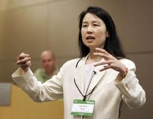
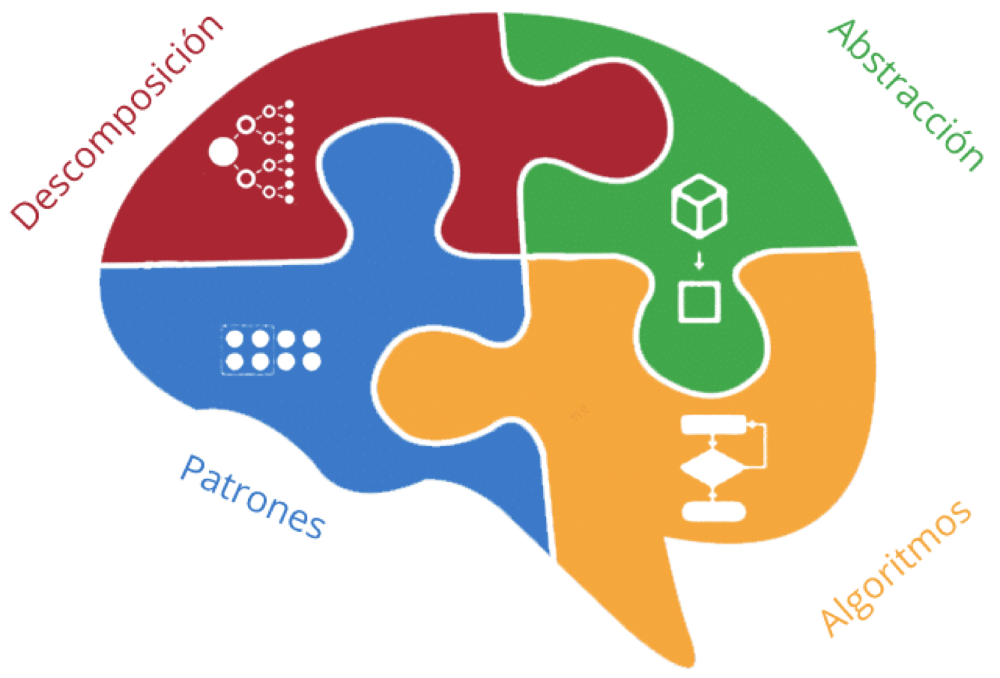

<h1 style="color: gray">Programación Orientada a Objetos</h1>

<h5 style="color: gray">Área de programación 
Programa de Ingeniería de Sistemas y Computación 
Facultad de Ingeniería
</h5>

<b>
<h2>Introducción</h2>
</b>

---

- Ana María Tamayo Ocampo
- Carlos Alberto Restrepo Ramirez	
- Carlos Andrés Flórez Villarraga
- Christian Andres Candela
- Daniel Estaban Ciro Rincon	
- Diana Marcela Rivera	
- Jhon Oscar Salazar Orozco
- Jorge Ivan Triviño
- Julián Esteban Gutiérrez Posada
- Luisa Fernanda Londoño Celis
- Robinson Arias Muñoz
- Soraya Caroilina Gonzalez Ramirez	

---

# **Programa de Ingeniería de Sistemas y Computación**
## Facultad de Ingeniería
### Universidad del Quindío

---

Estimular el desarrollo de la Programación Orientada a Objetos (**POO**) con un enfoque el desarrollo guiado por pruebas (**TDD**) y empleando los elementos del Pensamiento Computacional (**PC**).

## Aclaración

El curso busca ser más que un curso de programación Java, así que su foco está en aplicar los elementos del Pensamiento Computacional para facilitar el encontrar un modelo de la solución y probar el modelo mediante una batería de pruebas.

---

La **POO** es una forma de crear soluciones a un problema que es, en principio: 
- robustas
- flexibles
- fáciles de mantener

La idea es crear un conjunto de elementos (**objetos**) que se relacionan para colaborar y resolver el problema. Cada **objeto** debe tener:
- una responsabilidad bien definida. 
- un conjunto de datos (**estado**) y comportamientos (**funcionalidades**) acordes con su **responsabilidad**.

---

El **TDD** (*Test-Driven Development*) es una práctica de ingeniería de software que permite desarrollar un sistema comenzando por las pruebas que dicho sistema debe satisfacer.

## El ciclo del **TDD** es:

- Escriba un prueba (seguramente fallará)
- Ajuste el código para que pase la prueba
- Elimine el código redundante (refactorizar)

Solamente escriba código que se requiera para aprobar las pruebas.

---

- Proceso de pensamiento 
    involucrado en la formulación y solución de un problema, 
- Utiliza: 
    - la abstracción,
    - la descomposición, 
    - el reconocimiento de patrones y
    - la codificación.
- El algoritmo encontrado puede ser utilizado por una máquina o una persona.

<!---
_footer: Computational Thinking with Jeannette Wing
--->
---

- Es el proceso de:
  - filtrar los datos y su clasificación, 
  - ignorar los elementos que no son necesarios para 
  hacer el problema más comprensible sin perder 
  información importante.

- La meta es crear una representación de lo que se está resolviendo.

---

- **Preguntas orientadoras**:

  - ¿Qué se solicita finalmente? (problema)

  - ¿Qué información es relevante dado el problema 
  anterior?

  - ¿Cómo se agrupa la información relevante?

  - ¿Qué funcionalidades se solicitan?

---

- Proceso por el cual los problemas son divididos 
en partes menores (que serán más fáciles de 
entender).
- Estas partes serán:
    - examinadas y 
    - trabajadas individualmente.

- La descomposición permite aumentar la atención en los detalles.

---

- **Preguntas orientadoras**:

  - ¿Cómo se distribuyen las funcionalidades?
  - ¿Qué debo hacer para probar las funcionalidades?

---

- Los patrones son:
  - similaridades o 
  - características que 

  algunos de los problemas comparten.

- El reconocimiento de patrones permite resolver
problemas  haciendo uso de:
  - estrategias o 
  - soluciones previas.

---

- **Pregunta orientadora**:

  - ¿Qué puede reutilizar? (de la solución de otros
   problemas)

---

- Proceso de creación de un algoritmo
  (un plan, una estrategia, o un conjunto de pasos 
  / instrucciones)
    - Claras, 
    - Ordenadas, y 
    - Finitas para la solución del problema.

- El algoritmo pueden ser:
  - seguido por una persona o
  - adaptado (programa) para ser ejecutado por una máquina.

---

- **Preguntas orientadoras**:

  - ¿Cómo pruebo la solución en Java?
  - ¿Cómo escribo la solución en Java?

---

# Estructura de las soluciones

- Un directorio (**src**) que se subdivide en
  - (**main**) para almacenar el código.
  - (**test**) para almacenar las pruebas automatizadas

El código fuente deberá estar con la documentación interna necesaria, comenzando con:

- Breve descripción de objetivo del programa.
- Autor(es)
- Fecha
- Licencia, para el caso **GNU GPL v3**

---

<!-- 
_header: ''
_footer: '' 
_paginate: false
_backgroundImage: url('imagenes/gracias.png')
-->
