<div style="position: absolute; left: 30%; top:45%; width: 70%; text-align: left"><h1 style="color: gray">Programación Orientada a Objetos</h1></div>
<div style="position: absolute; left: 30%; top:55%; width: 70%; text-align: left"><h5 style="color: gray">Área de programación<br />
Programa de Ingeniería de Sistemas y Computación<br />
Facultad de Ingeniería
</h5></div>

<div style="position: absolute; left: 45%; top:20%; background-color: rgb(212, 231, 205); width: 550px; display:table-cell; text-align: center; padding: 30px 0;">
<b>
<h2>Herramientas</h2>
</b>
</div>


<div style="position: absolute; left: 93%; top:10px; ">


</div>

---


<style scoped>
.texto:after {
    content: 'Herramientas a instalar';
  }
</style>

- OpenJDK 17 (https://adoptium.net/es) 
- Visual Studio Code Versión 1.80 (https://code.visualstudio.com/)
  - Extension Pack for Java Versión 0.25.12
  - yUML (UML diagramming tool based on  the yUML syntax) - Versión 3.5.1
  - Marp for VS Code - Versión 2.6.0
- Git (https://git-scm.com)
- Maven Apache (https://maven.apache.org)
- Instalación del arquetipo Maven de Uniquindio crear nuevos proyectos para el curso (https://sara.uniquindio.edu.co/m2/m2.zip).
- Clonado el repositorio del curso en GitHub


---
<!-- OpenJDK -->
<style scoped>
.texto:after {
    content: '';
  }
</style>

# OpenJDK 17 (https://adoptium.net/es)

Ingrese al siguiente enlace y descargue la última versión de LTS (*Long Term Support*)

---
<!-- OpenJDK -->
<style scoped>
.texto:after {
    content: 'Ingrese al sitio: https://adoptium.net/es';
  }
</style>

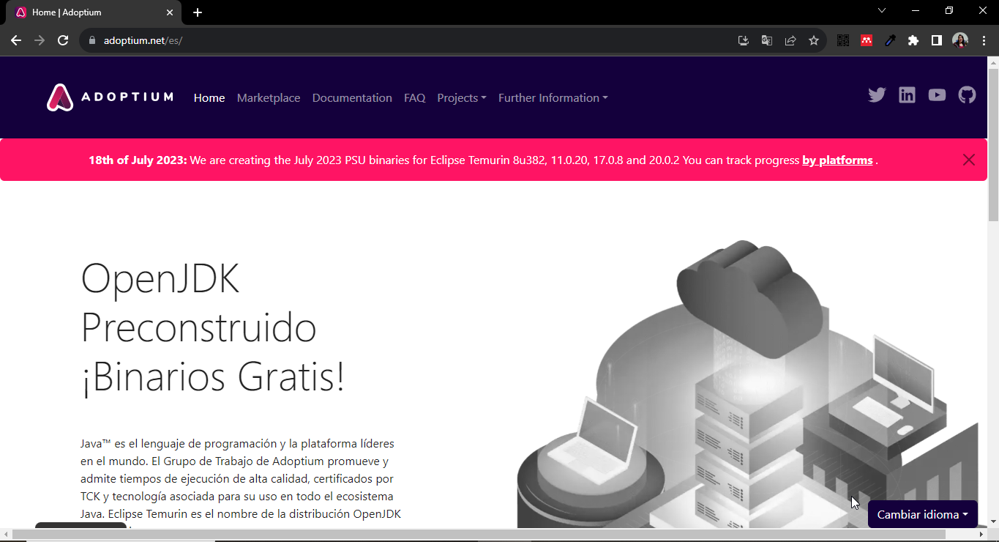


---
<!-- OpenJDK -->
<style scoped>
.texto:after {
    content: 'Clic sobre "Última versión de LTS"';
  }
</style>

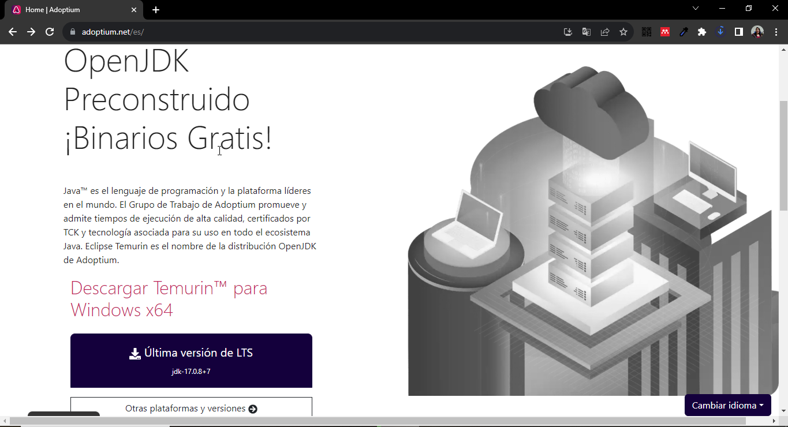

---
<!-- OpenJDK -->
<style scoped>
.texto:after {
    content: 'Esperar hasta que descargue';
  }
</style>

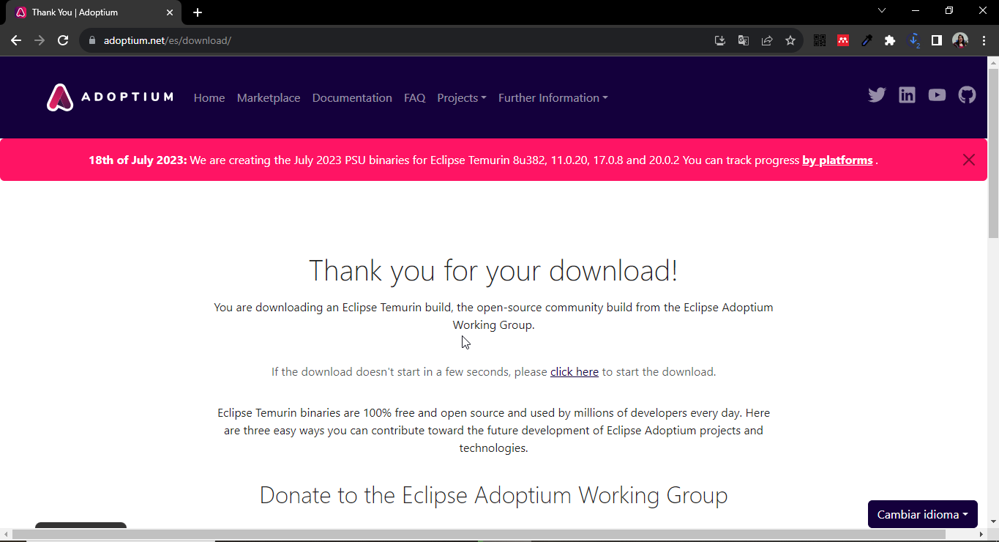


---
<!-- OpenJDK -->
<style scoped>
.texto:after {
    content: 'Esperar hasta que descargue';
  }
</style>

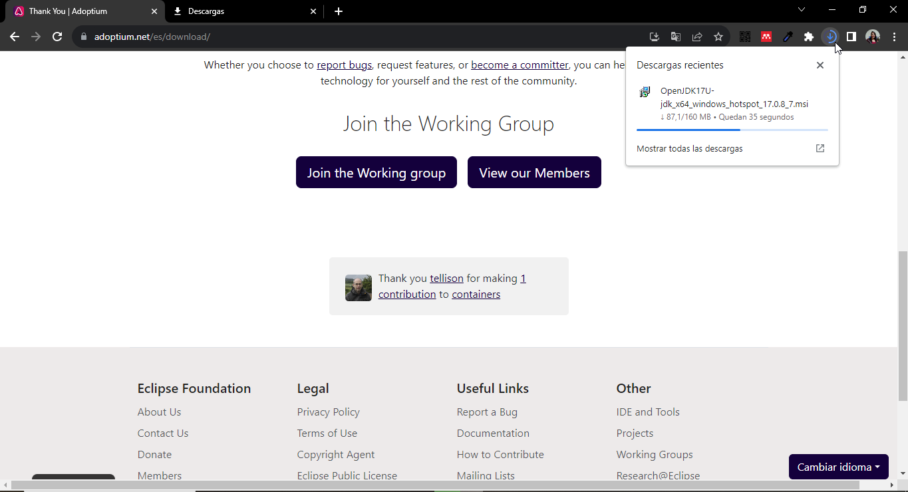

---

<!-- OpenJDK -->
<style scoped>
.texto:after {
    content: 'Ejecute el instalador';
  }
</style>

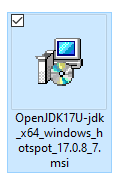

---

<!-- OpenJDK -->
<style scoped>
.texto:after {
    content: 'Siga el asistente de instalación OpenJDK 17';
  }
</style>

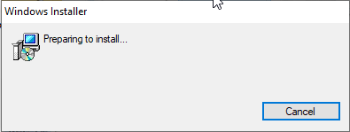

---

<!-- OpenJDK -->
<style scoped>
.texto:after {
    content: 'Siga el asistente de instalación OpenJDK 17';
  }
</style>

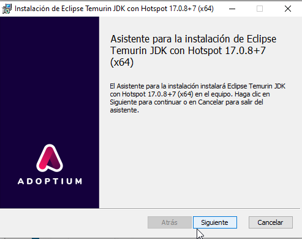

---

<!-- OpenJDK -->
<style scoped>
.texto:after {
    content: 'Siga el asistente de instalación OpenJDK 17';
  }
</style>

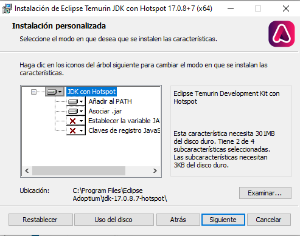

---

<!-- OpenJDK -->
<style scoped>
.texto:after {
    content: 'Siga el asistente de instalación OpenJDK 17';
  }
</style>

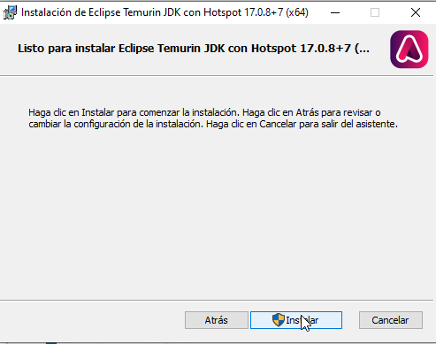

---

<!-- OpenJDK -->
<style scoped>
.texto:after {
    content: 'Siga el asistente de instalación OpenJDK 17';
  }
</style>

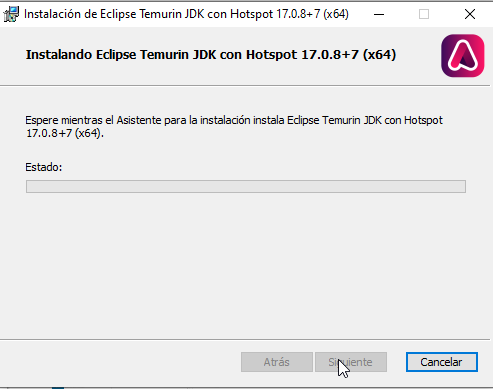

---

<!-- OpenJDK -->
<style scoped>
.texto:after {
    content: 'Siga el asistente de instalación OpenJDK 17';
  }
</style>

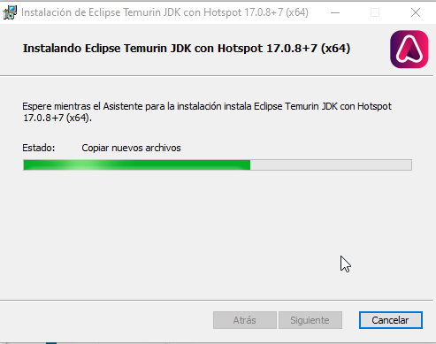

---

<!-- OpenJDK -->
<style scoped>
.texto:after {
    content: 'Siga el asistente de instalación OpenJDK 17';
  }
</style>

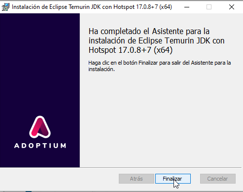

---

<!-- VSCode -->
<style scoped>
.texto:after {
    content: 'Ingrese al sitio: https://code.visualstudio.com/';
  }
</style>

# Visual Studio Code (https://code.visualstudio.com/)

Ingrese al siguiente enlace y descargue la última versión haciendo clic en "Download"

---


<!-- VSCode -->
<style scoped>
.texto:after {
    content: 'Clic en "Download for Windows"';
  }
</style>

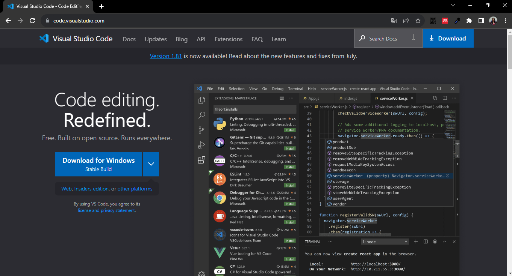


---

<!-- VSCode -->
<style scoped>
.texto:after {
    content: 'Esperar que comience la descarga';
  }
</style>

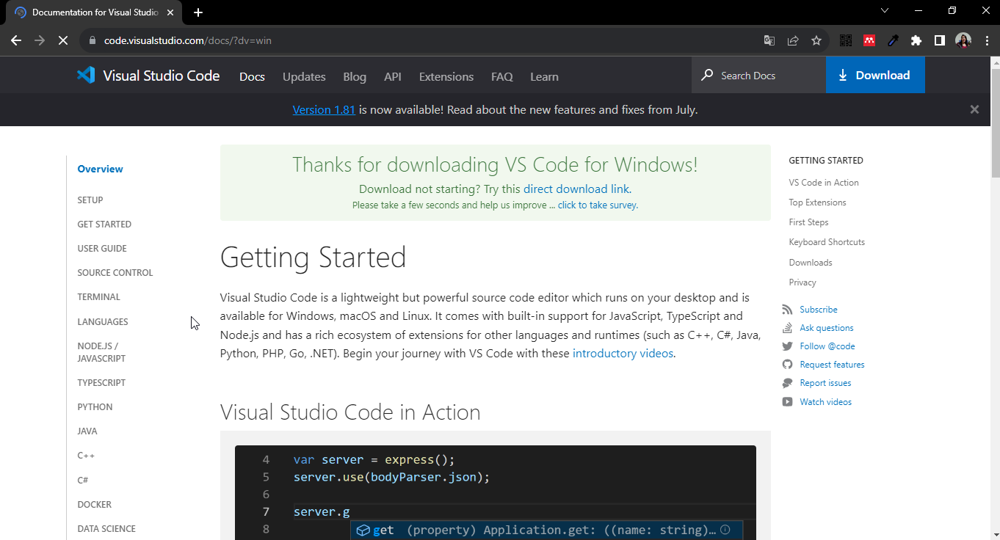

---

<!-- VSCode -->
<style scoped>
.texto:after {
    content: 'Esperar que comience la descarga';
  }
</style>

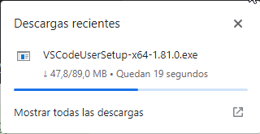

---

<!-- VSCode -->
<style scoped>
.texto:after {
    content: 'Ejecute el instalador que descargó';
  }
</style>

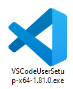

---

<!-- VSCode -->
<style scoped>
.texto:after {
    content: 'Acepte el acuerdo y presione "Siguiente"';
  }
</style>

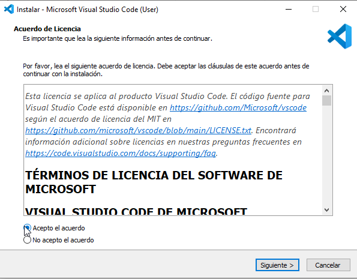

---

<!-- VSCode -->
<style scoped>
.texto:after {
    content: 'Siga el asistente de instalación';
  }
</style>

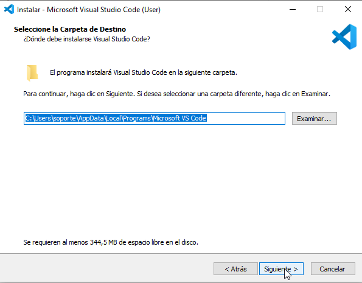

---

<!-- VSCode -->
<style scoped>
.texto:after {
    content: 'Siga el asistente de instalación';
  }
</style>

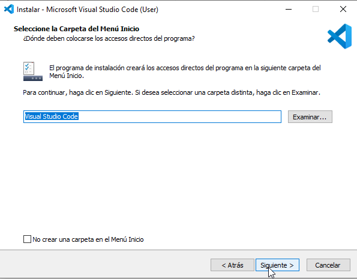

---

<!-- VSCode -->
<style scoped>
.texto:after {
    content: 'Siga el asistente de instalación';
  }
</style>

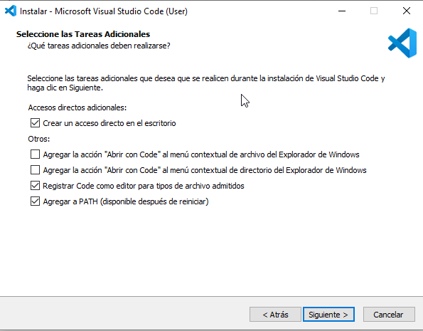

---

<!-- VSCode -->
<style scoped>
.texto:after {
    content: 'Siga el asistente de instalación';
  }
</style>

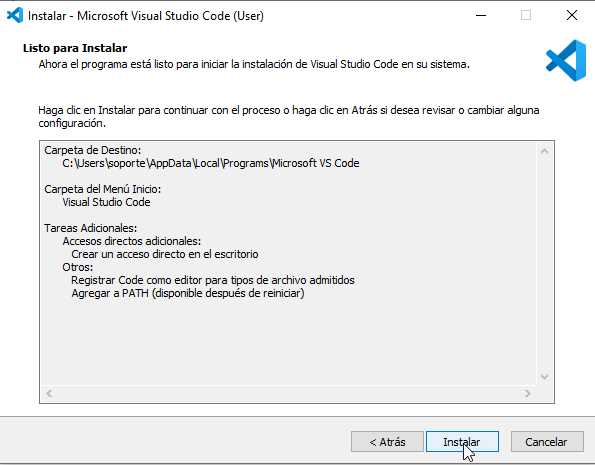


---

<!-- VSCode -->
<style scoped>
.texto:after {
    content: 'Espere que la instalación termine';
  }
</style>

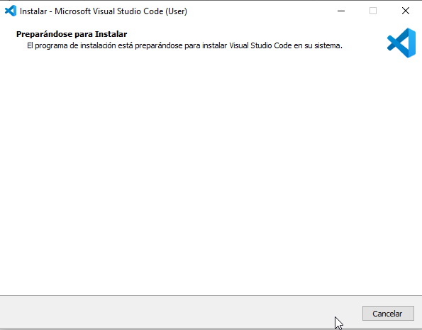

---

<!-- VSCode -->
<style scoped>
.texto:after {
    content: 'Espere que la instalación termine';
  }
</style>

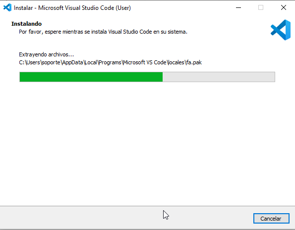

---

<!-- VSCode -->
<style scoped>
.texto:after {
    content: 'Espere que la instalación termine';
  }
</style>

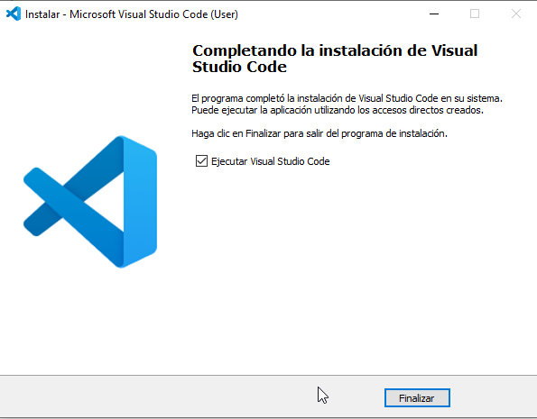

---

<!-- VSCode -->
<style scoped>
.texto:after {
    content: 'Ejecute la aplicación "Visual Studio Code"';
  }
</style>

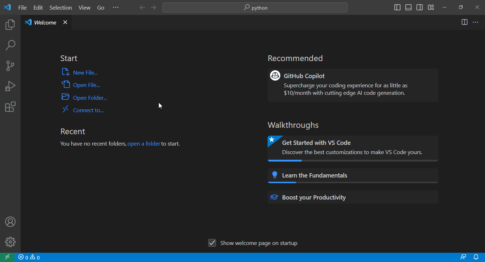

---

<!-- VSCode -->
<style scoped>
.texto:after {
    content: '';
  }
</style>

# Instalando la extensión "**Extension Pack for Java**"

Esta extensión incluye un conjunto de extensiones de uso profesional a nivel de desarrollo en **Java**

  - Language Support for Java(TM)
  - Debugger for Java
  - Test Runner for Java
  - Maven for Java
  - Project Manager for Java
  - IntelliCode

---

<!-- VSCode: Extension Pack for Java -->
<style scoped>
.texto:after {
    content: 'Clic en extensiones (quinto icono del lado izquierdo) e instalar "Extension Pack for Java"';
  }
</style>

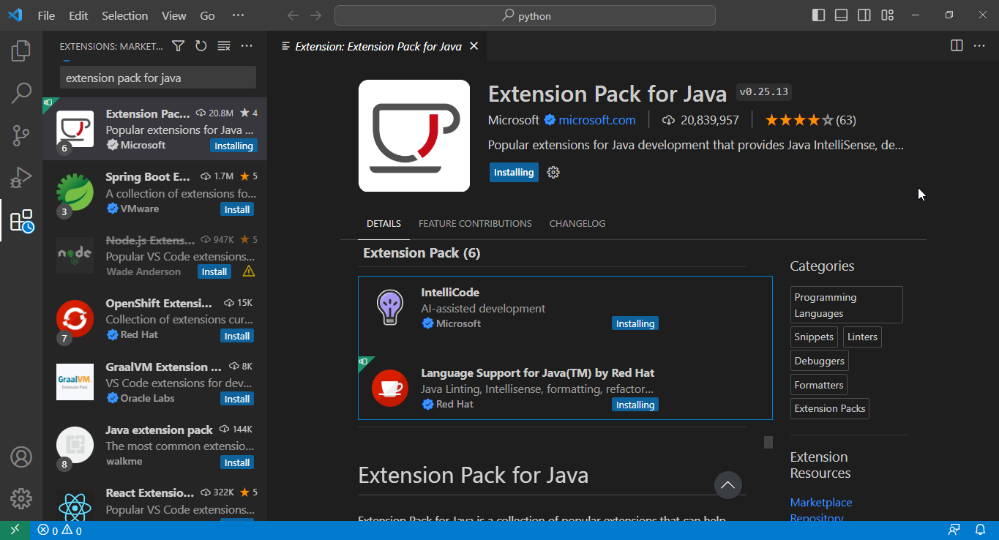

---

<!-- VSCode -->
<style scoped>
.texto:after {
    content: '';
  }
</style>

# Instalando la extensión "**yUML**"

Este extensión **yUML** (*UML diagramming tool based on the yUML syntax*) permite crear diagramas de **UML** (*Unified Modeling Language*) necesarios para modelar una solución antes de llegar al código.


---

<!-- VSCode:yUML -->
<style scoped>
.texto:after {
    content: 'Clic en extensiones (quinto icono del lado izquierdo) e instalar "yUML"';
  }
</style>

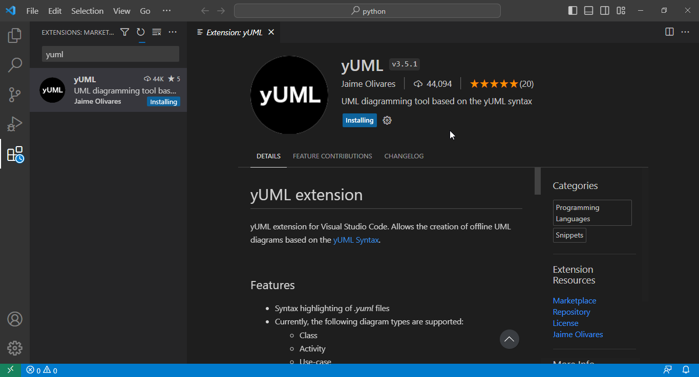

---

<!-- VSCode -->
<style scoped>
.texto:after {
    content: '';
  }
</style>

# Instalando la extensión "**Marp for VS Code**"

Este extensión **Marp for VS Code** permite crear presentaciones directamente en **Visual Studio Code** usando un lenguaje llamado **Markdown**.

---

<!-- VSCode: Marp -->
<style scoped>
.texto:after {
    content: 'Clic en extensiones (quinto icono del lado izquierdo) e instalar "Marp for VS Code"';
  }
</style>

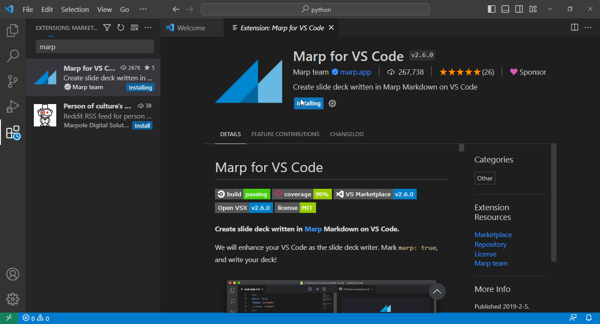

---

<!-- VSCode: Marp -->
<style scoped>
.texto:after {
    content: 'Clic derecho en la extensión "Marp" y seleccionar "Extension Settings"';
  }
</style>

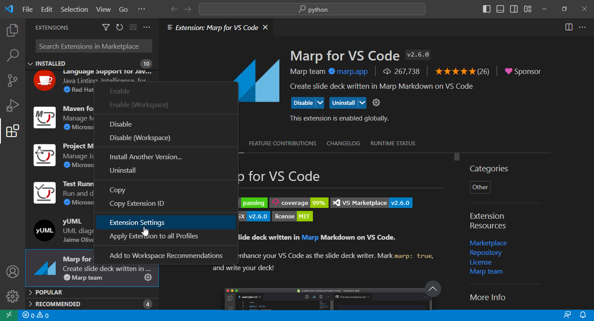

---

<!-- VSCode: Marp -->
<style scoped>
.texto:after {
    content: 'Active "Markdown > Marp: Enable HTML';
  }
</style>

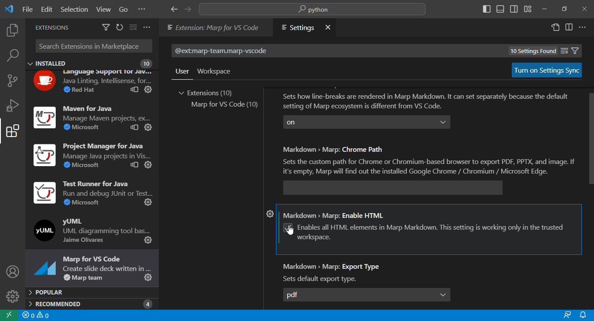


---

<!-- VSCode -->
<style scoped>
.texto:after {
    content: '';
  }
</style>

# Al final debe terminar con 10 extensiones instaladas

Verifique que las 10 extensiones si están instaladas en su **Visual Studio Code**.

Opcionalmente puede instalar las extensiones:
- **Spanish - Code Spell Checker** (*Spanish Add-On for Code Spell Checker*) para verificar la escritura de palabras en español. 
- **vscode-pdf** (*Display pdf file in VSCode*) para poder ver los archivo **PDF** directamente en **Visual Studio Code**.
- **Git Graph** (*Git Graph extension for Visual Studio Code*) extensión para ver las ramas de Git.
---

<!-- VSCode: Extensiones -->
<style scoped>
.texto:after {
    content: 'Verifique las extensiones instaladas';
  }
</style>

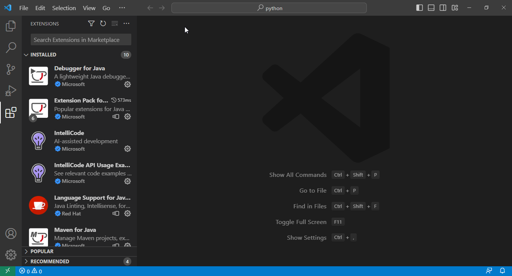
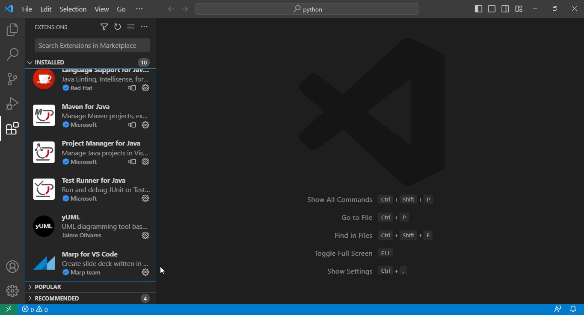

---

<!-- VSCode -->
<style scoped>
.texto:after {
    content: '';
  }
</style>

# Instalando la herramienta "Git"

**Git** es una herramienta para el control de versiones tanto a nivel local como en la nube usando servios como **github** o **gitlab**. 

Esto permite llevar un control de un proyecto a nivel profesional, especialmente útil cuando se tiene un equipo de programadores.


---

<!-- VSCode: Git -->
<style scoped>
.texto:after {
    content: 'Clic en "Source Control" (tercer icono del lado izquierdo) y clic "Download Git for Windows"';
  }
</style>

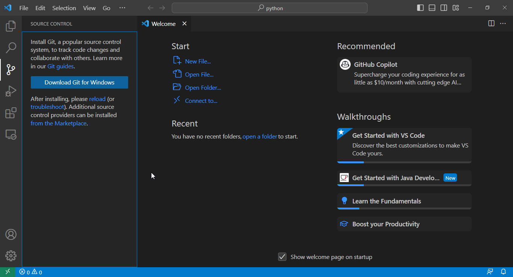

---

<!-- VSCode: Git -->
<style scoped>
.texto:after {
    content: 'Clic en "Open"para abrir la página de descarga';
  }
</style>

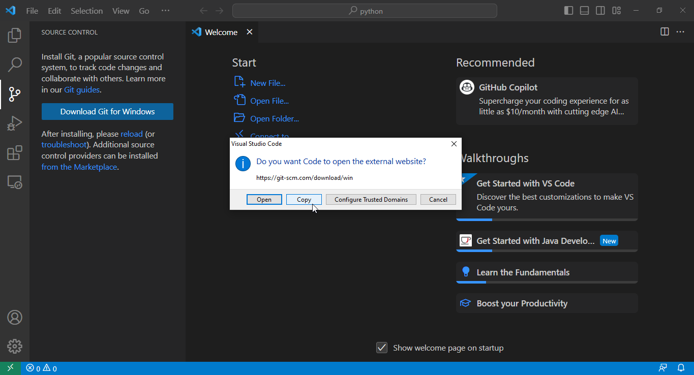

---

<!-- VSCode: Git -->
<style scoped>
.texto:after {
    content: 'Presione "Click here to download"';
  }
</style>

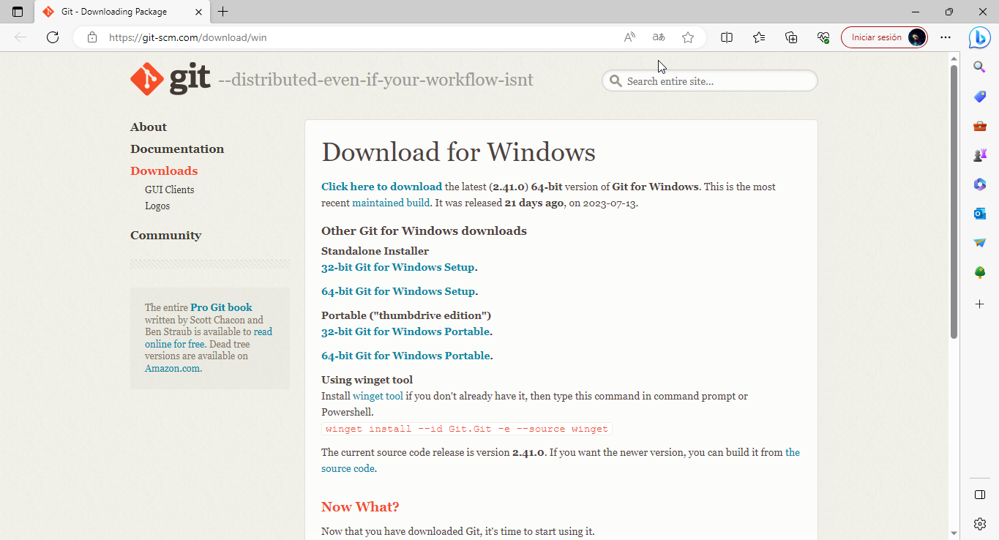

---

<!-- VSCode: Git -->
<style scoped>
.texto:after {
    content: 'Esperar que descargue';
  }
</style>

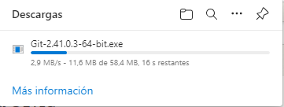

---

<!-- VSCode: Git -->
<style scoped>
.texto:after {
    content: 'Ejecute la aplicación descargada';
  }
</style>

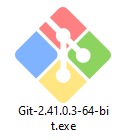

---

<!-- VSCode: Git -->
<style scoped>
.texto:after {
    content: 'Siga el asistente de instalación';
  }
</style>

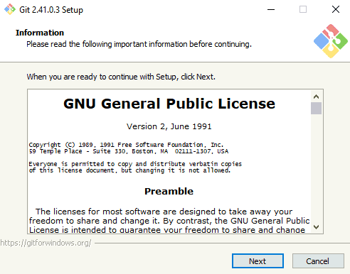

---

<!-- VSCode: Git -->
<style scoped>
.texto:after {
    content: 'Siga el asistente de instalación';
  }
</style>

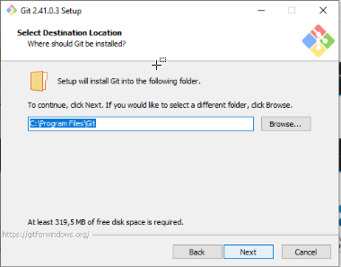


---

<!-- VSCode: Git -->
<style scoped>
.texto:after {
    content: 'Siga el asistente de instalación';
  }
</style>

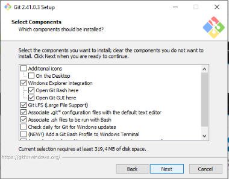


---

<!-- VSCode: Git -->
<style scoped>
.texto:after {
    content: 'Siga el asistente de instalación';
  }
</style>

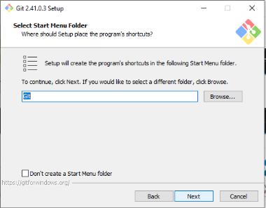


---

<!-- VSCode: Git -->
<style scoped>
.texto:after {
    content: 'Siga el asistente de instalación';
  }
</style>

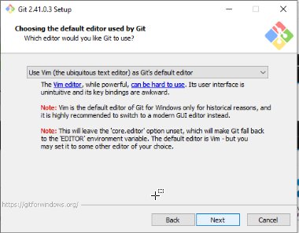

---

<!-- VSCode: Git -->
<style scoped>
.texto:after {
    content: 'Siga el asistente de instalación';
  }
</style>

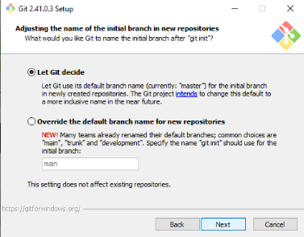

---

<!-- VSCode: Git -->
<style scoped>
.texto:after {
    content: 'Siga el asistente de instalación';
  }
</style>

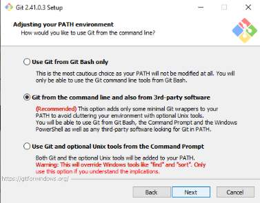

---

<!-- VSCode: Git -->
<style scoped>
.texto:after {
    content: 'Siga el asistente de instalación';
  }
</style>

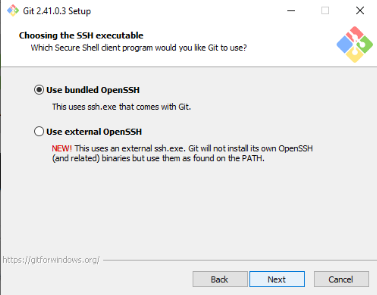

---

<!-- VSCode: Git -->
<style scoped>
.texto:after {
    content: 'Siga el asistente de instalación';
  }
</style>

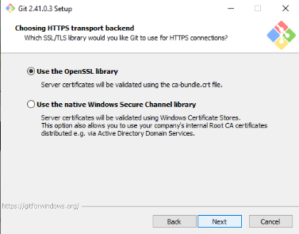

---

<!-- VSCode: Git -->
<style scoped>
.texto:after {
    content: 'Siga el asistente de instalación';
  }
</style>

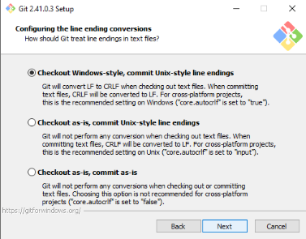

---

<!-- VSCode: Git -->
<style scoped>
.texto:after {
    content: 'Siga el asistente de instalación';
  }
</style>

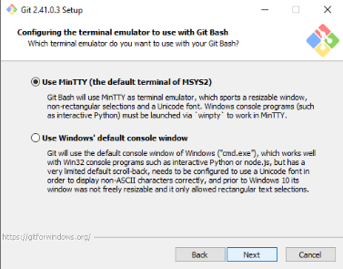

---

<!-- VSCode: Git -->
<style scoped>
.texto:after {
    content: 'Siga el asistente de instalación';
  }
</style>

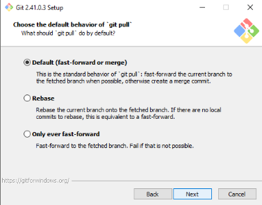

---

<!-- VSCode: Git -->
<style scoped>
.texto:after {
    content: 'Siga el asistente de instalación';
  }
</style>

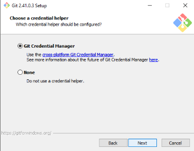

---

<!-- VSCode: Git -->
<style scoped>
.texto:after {
    content: 'Siga el asistente de instalación';
  }
</style>

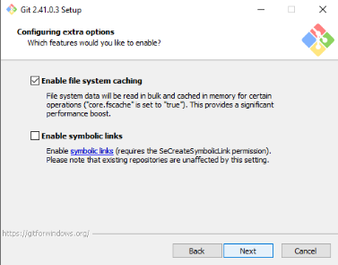


---

<!-- VSCode: Git -->
<style scoped>
.texto:after {
    content: 'Siga el asistente de instalación';
  }
</style>

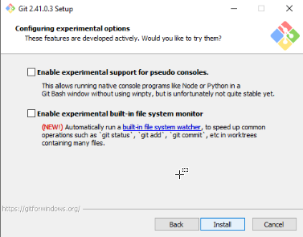


---

<!-- VSCode: Git -->
<style scoped>
.texto:after {
    content: 'Espere hasta que termine la instalación';
  }
</style>

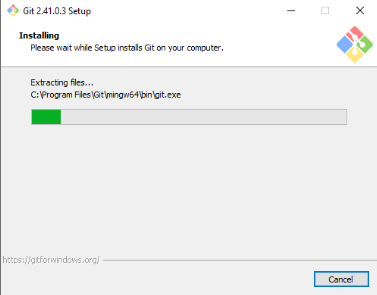


---

<!-- VSCode: Git -->
<style scoped>
.texto:after {
    content: 'Termine la instalación';
  }
</style>

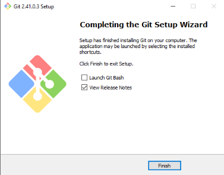


---

<!-- VSCode: Git -->
<style scoped>
.texto:after {
    content: 'Cierre la página de "Release Notes"';
  }
</style>

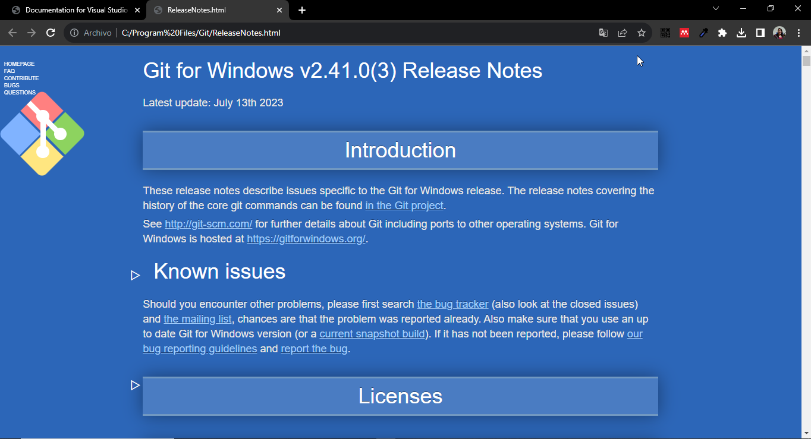


---

<!-- VSCode: Git -->
<style scoped>
.texto:after {
    content: 'Paso en la instalación de Git';
  }
</style>

# Configuración básica


En una terminal del sistema o del mismo Visual Studio Code ejecute los comandos:

- Este comando registra su nombre
  ```shell
  $ git config --global user.name "escriba aquí su nombre"
  ```

- Este comando registra su correo electrónico (email)
  ```shell
  $ git config --global user.email escriba_aqui_su_correo
  ```


---

<!-- VSCode -->
<style scoped>
.texto:after {
    content: '';
  }
</style>

# La instalación de **Maven**

**Maven** es una herramienta para gestionar dependencias y es muy utilizada en la industria, pero no la utilizaremos directamente en el curso.

---
<!-- MAVEN -->
<style scoped>
.texto:after {
    content: 'Ingrese al sitio: https://maven.apache.org/';
  }
</style>

# Maven (https://maven.apache.org/)

Ingrese al siguiente enlace y descargue la última versión haciendo clic en "Download"

---

<!-- MAVEN -->
<style scoped>
.texto:after {
    content: 'Esperar hasta que descargue';
  }
</style>

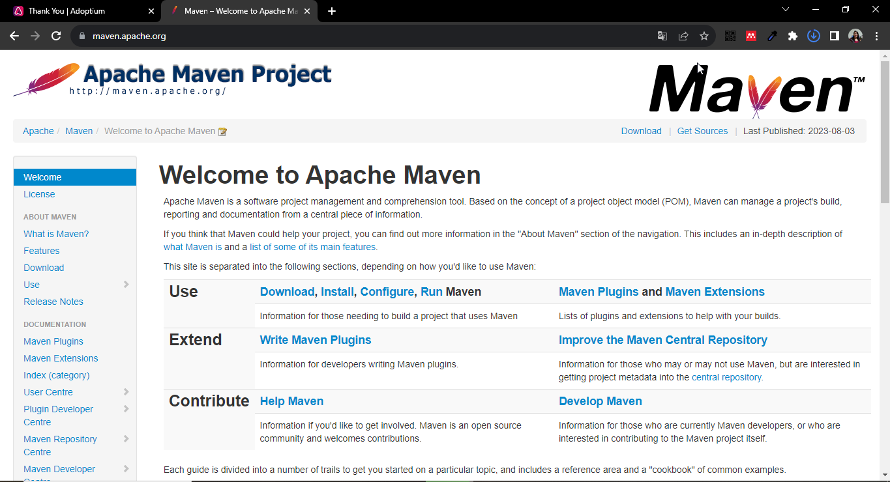

---

<!-- MAVEN -->
<style scoped>
.texto:after {
    content: 'Ir a la sección (Files)';
  }
</style>

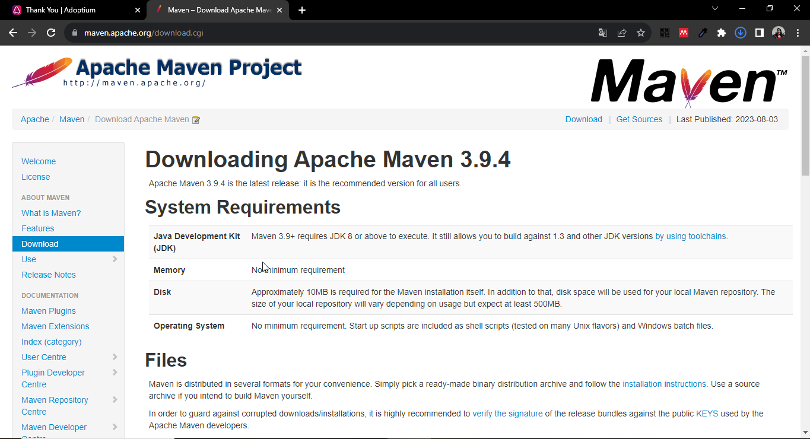

---

<!-- MAVEN -->
<style scoped>
.texto:after {
    content: 'Descargar: apache-maven-3.9.4-bin.zip';
  }
</style>

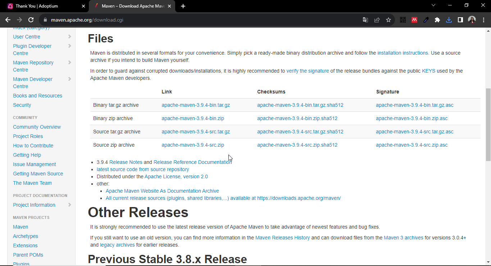

---

<!-- MAVEN -->
<style scoped>
.texto:after {
    content: 'Esperar la descarga';
  }
</style>

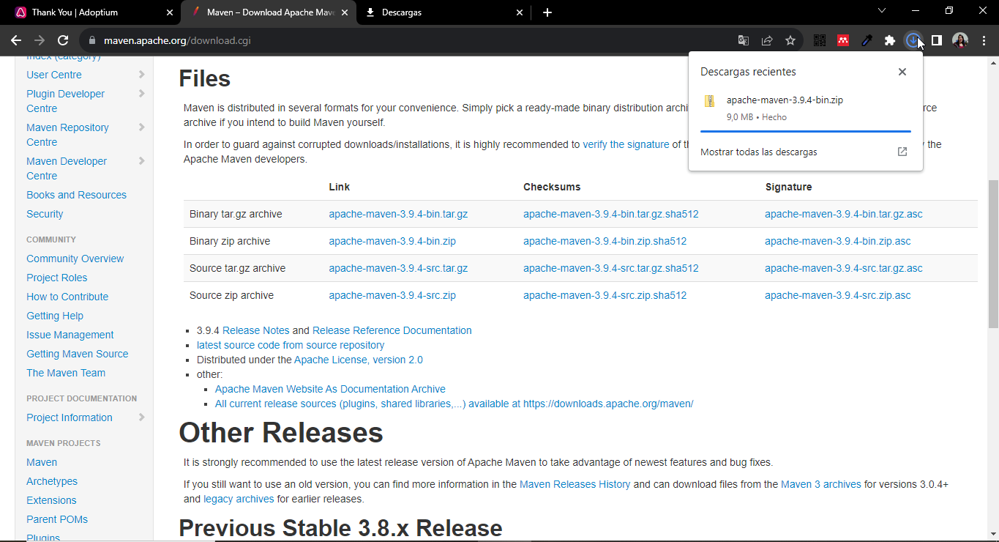

---

<!-- MAVEN -->
<style scoped>
.texto:after {
    content: 'Clic derecho descargado y  "Extraer todo..."';
  }
</style>


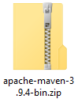
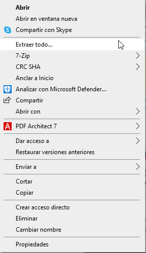


---

<!-- MAVEN -->
<style scoped>
.texto:after {
    content: 'Cambien la carpeta a "C:\\Program Files"';
  }
</style>

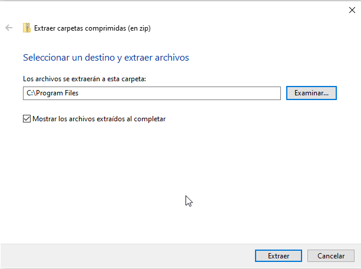

---

<!-- MAVEN -->
<style scoped>
.texto:after {
    content: '"Continuar" para dar permiso para descomprimir';
  }
</style>

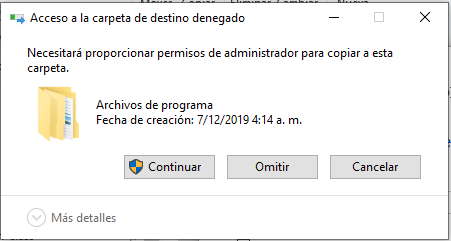

---

<!-- MAVEN -->
<style scoped>
.texto:after {
    content: 'Esperar que se descomprima';
  }
</style>

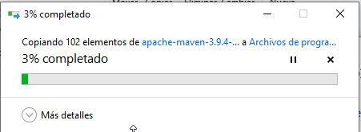

---

<!-- MAVEN -->
<style scoped>
.texto:after {
    content: 'Buscar "Editar las variables de entorno"';
  }
</style>

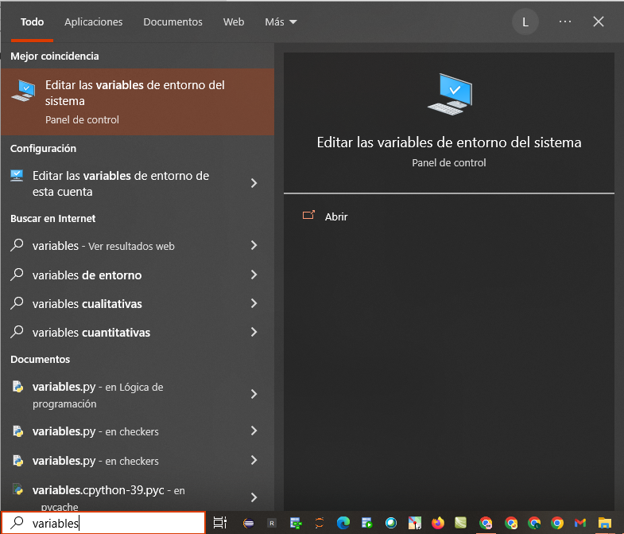

---

<!-- MAVEN -->
<style scoped>
.texto:after {
    content: 'Clic en "Variables de entorno..."';
  }
</style>

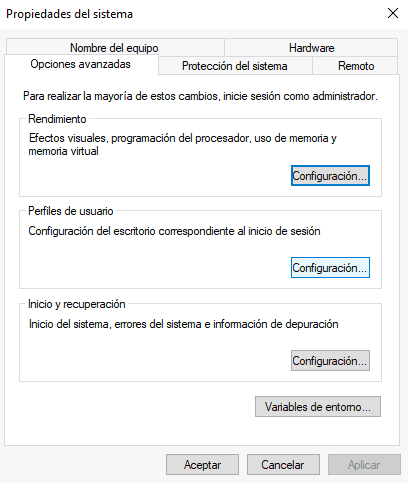


---

<!-- MAVEN -->
<style scoped>
.texto:after {
    content: 'Editar "Path" de variables del sistema';
  }
</style>

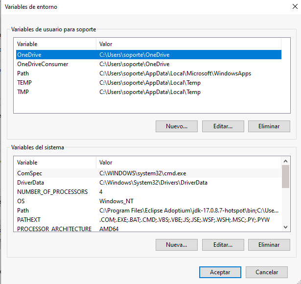

---

<!-- MAVEN -->
<style scoped>
.texto:after {
    content: 'Seleccione "Nuevo"';
  }
</style>

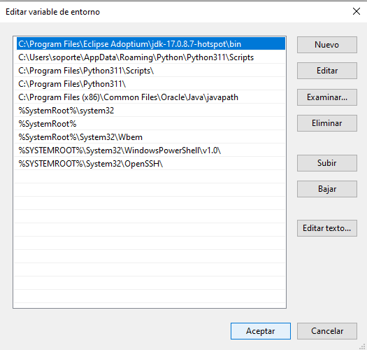


---

<!-- MAVEN -->
<style scoped>
.texto:after {
    content: 'Seleccione la carpeta "bin"de Maven';
  }
</style>

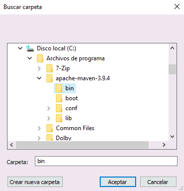

---

<!-- MAVEN -->
<style scoped>
.texto:after {
    content: 'Verifique que "apache-maven" esté en la lista';
  }
</style>

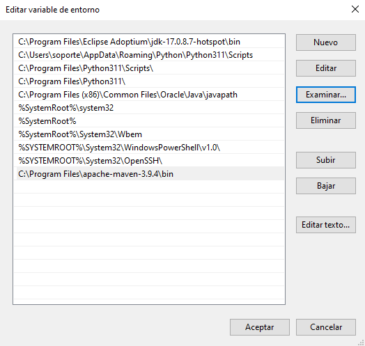

---

<!-- VSCode -->
<style scoped>
.texto:after {
    content: '';
  }
</style>

# La instalación del **Arquetipo Maven de Uniquindio**

El arquetipo Maven de Uniquindio (**arquetipo-poo-uq**) es una plantilla lista para crear nuevo proyecto para este curso de programación orientada a objetos.


---
<!-- Arquetipo MAVEN -->
<style scoped>
.texto:after {
    content: 'Descargue el archivo: https://sara.uniquindio.edu.co/m2/m2.zip';
  }
</style>


<div style="position: absolute; left: 60%; top:50%; ">
<a href= "https://sara.uniquindio.edu.co/m2/"> https://sara.uniquindio.edu.co/m2/</a>
</div>

---

<!-- Arquetipo MAVEN -->
<style scoped>
.texto:after {
    content: 'Descomprima el archivo m2.zip';
  }
</style>

- Descomprima el archivo **m2.zip** en su directorio **HOME**.

  - **Windows**: *C:\Usuarios\SuUsuario*

  - **Linux**: */home/SuUsuario*

  - **MacOs**: */Users/SuUsuario*

  De ser necesario, sobreescriba los archivos.

--- 
<!-- Arquetipo MAVEN -->
<style scoped>
.texto:after {
    content: 'Por ejemplo en MacOS: /Users/jugutier';
  }
</style>

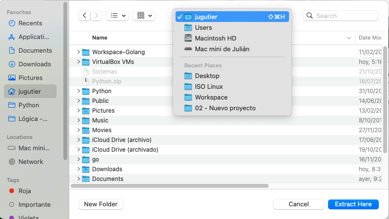


---


<!-- Arquetipo MAVEN -->
<style scoped>
.texto:after {
    content: 'VSCode: Cree un nuevo proyecto Java';
  }
</style>


---

<!-- Arquetipo MAVEN -->
<style scoped>
.texto:after {
    content: 'Seleccionar un proyecto Maven';
  }
</style>

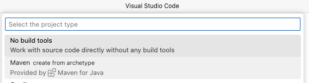

---

<!-- Arquetipo MAVEN -->
<style scoped>
.texto:after {
    content: 'Seleccionar "arquetipo-poo-uq"';
  }
</style>


---

<!-- Arquetipo MAVEN -->
<style scoped>
.texto:after {
    content: 'Confirmar la versión del proyecto';
  }
</style>

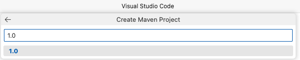

---

<!-- Arquetipo MAVEN -->
<style scoped>
.texto:after {
    content: 'Indicar el Group ID, por ejemplo: "co.edu.uniquindio.poo"';
  }
</style>

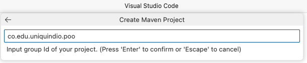

---

<!-- Arquetipo MAVEN -->
<style scoped>
.texto:after {
    content: 'Ingresar el nombre del proyecto';
  }
</style>


---

<!-- Arquetipo MAVEN -->
<style scoped>
.texto:after {
    content: 'Seleccionar la carpeta destino para el proyecto, por ejemplo, Workspace-Proyecto';
  }
</style>


---

<!-- Arquetipo MAVEN -->
<style scoped>
.texto:after {
    content: 'Confirmar los datos en la terminal <Enter>';
  }
</style>

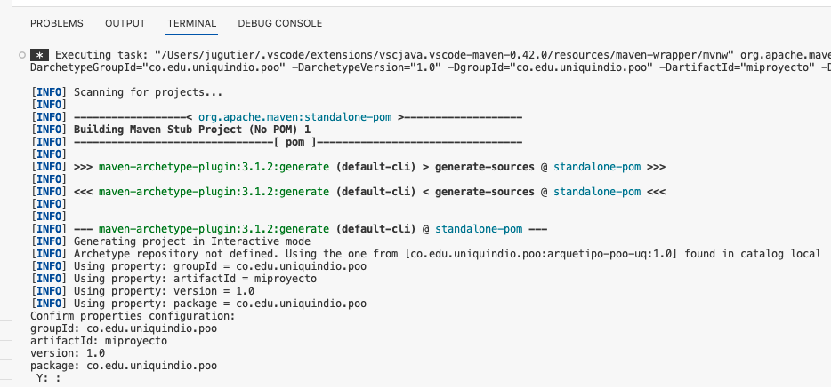

---

<!-- Arquetipo MAVEN -->
<style scoped>
.texto:after {
    content: 'Esperar que el proyecto se cree correctamente...';
  }
</style>


---

<!-- Arquetipo MAVEN -->
<style scoped>
.texto:after {
    content: 'Abra el proyecto recién creado';
  }
</style>


---

<!-- Arquetipo MAVEN -->
<style scoped>
.texto:after {
    content: 'Observe la estructura del nuevo proyecto';
  }
</style>

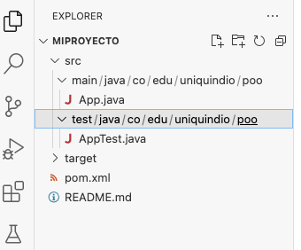

---

<!-- Arquetipo MAVEN -->
<style scoped>
.texto:after {
    content: 'App.java';
  }
</style>


---

<!-- Arquetipo MAVEN -->
<style scoped>
.texto:after {
    content: 'AppTest.java';
  }
</style>


---

<!-- Arquetipo MAVEN -->
<style scoped>
.texto:after {
    content: 'pom.xml';
  }
</style>

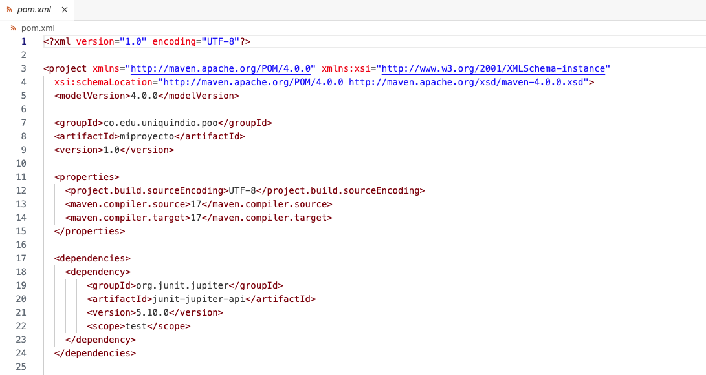

---

<!-- Arquetipo MAVEN -->
<style scoped>
.texto:after {
    content: 'pom.xml';
  }
</style>

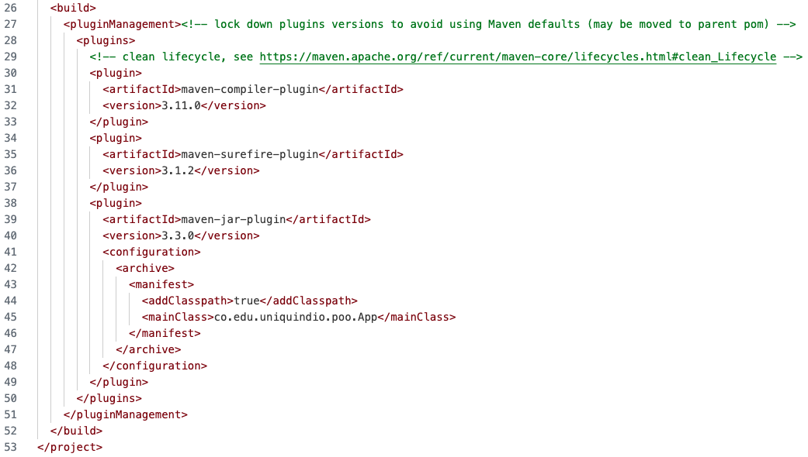

---

<!-- Arquetipo MAVEN -->
<style scoped>
.texto:after {
    content: 'Ejecute la prueba generada';
  }
</style>

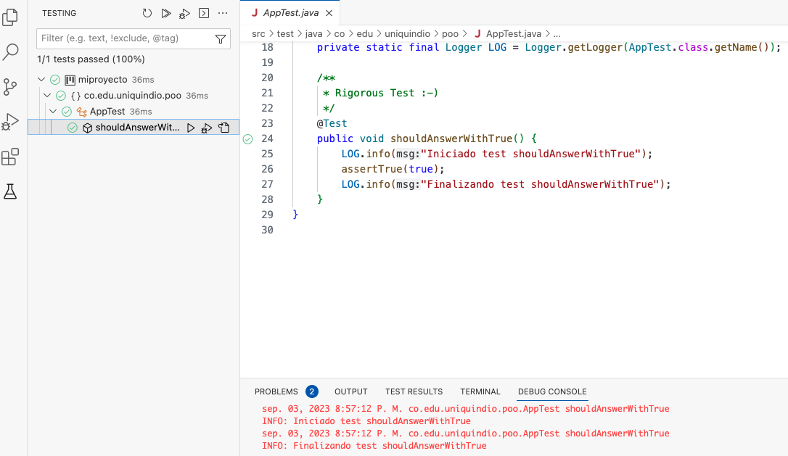

---

<!-- Arquetipo MAVEN -->
<style scoped>
.texto:after {
    content: 'Cierre la carpeta de trabajo';
  }
</style>


---

<!-- VSCode -->
<style scoped>
.texto:after {
    content: '';
  }
</style>

# Clonado el repositorio del curso en GitHub

Todo el material del curso, desarrollado paso a paso se encuentra de forma pública en el repositorio de **GitHub** https://github.com/grid-uq/poo 

Allí encontrará desde esta presentación (creada enteramente con **Marp**), así como el análisis, el diseño, la codificación y las pruebas de los diferentes requisitos por cada ejercicio desarrollado en el curso.

Lo que se busca es ir explicando los conceptos que se requieren en el momento justo de tal forma que se puedan resolver los problemas propuestos con sus diferentes requisitos.

---

<!-- VSCode: Repositorio -->
<style scoped>
.texto:after {
    content: 'Clic en "Clone Git Repository"';
  }
</style>

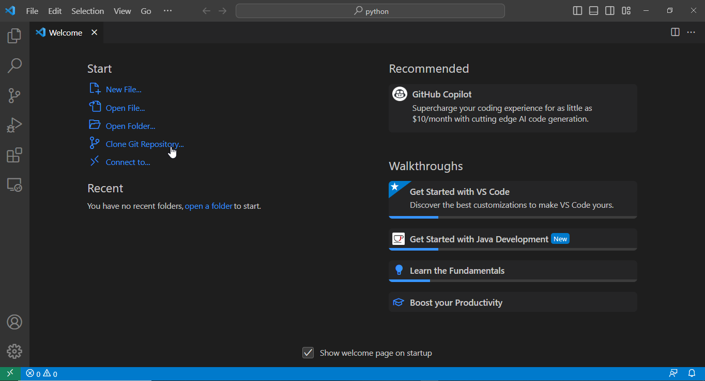

---

<!-- VSCode: Repositorio -->
<style scoped>
.texto:after {
    content: 'Escriba "https://github.com/grid-uq/poo"';
  }
</style>

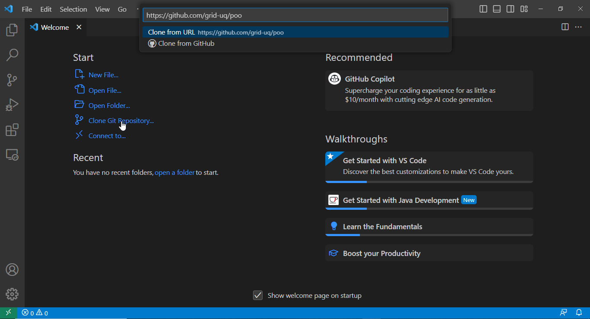

---

<!-- VSCode: Repositorio -->
<style scoped>
.texto:after {
    content: 'Cree y seleccione una carpeta de trabajo';
  }
</style>

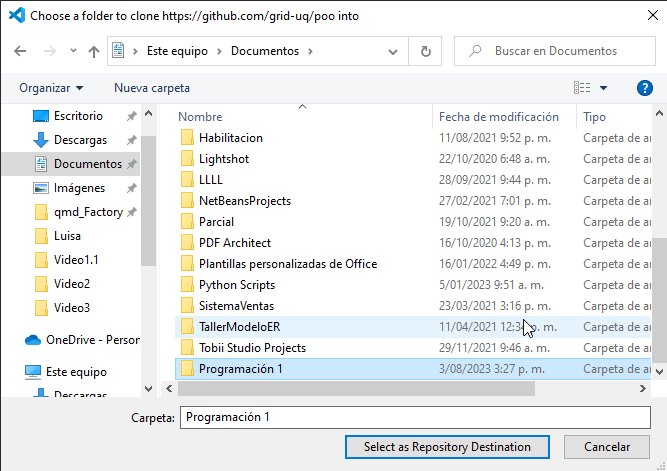

---

<!-- VSCode: Repositorio -->
<style scoped>
.texto:after {
    content: 'Haga clic en "Open"';
  }
</style>

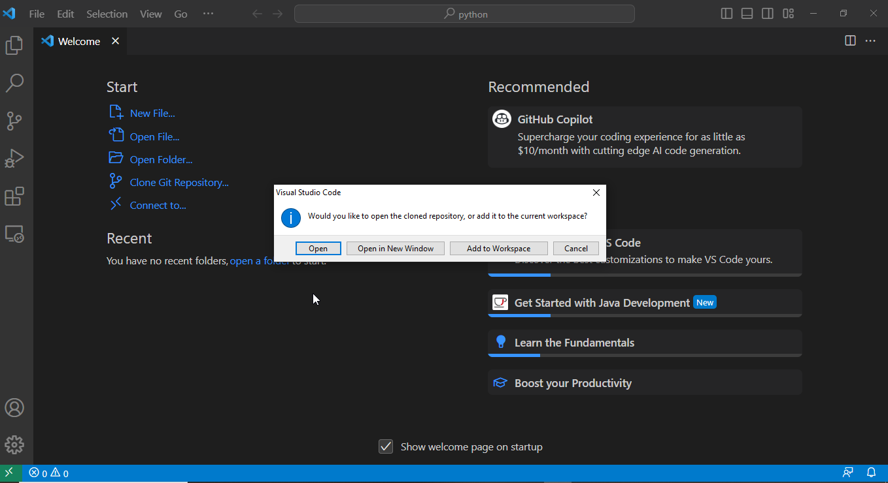

---

<!-- VSCode: Repositorio -->
<style scoped>
.texto:after {
    content: 'Haga clic en "Yes" para indicar que son autores de confianza';
  }
</style>

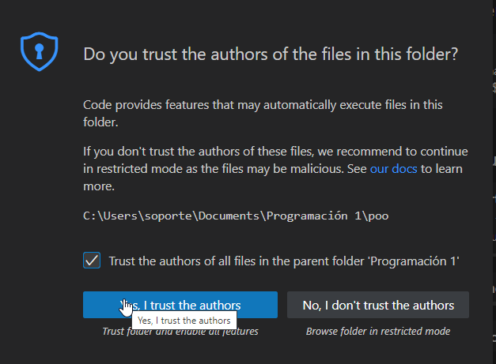

---

<!-- VSCode: Repositorio -->
<style scoped>
.texto:after {
    content: 'Confirme el resultado final';
  }
</style>

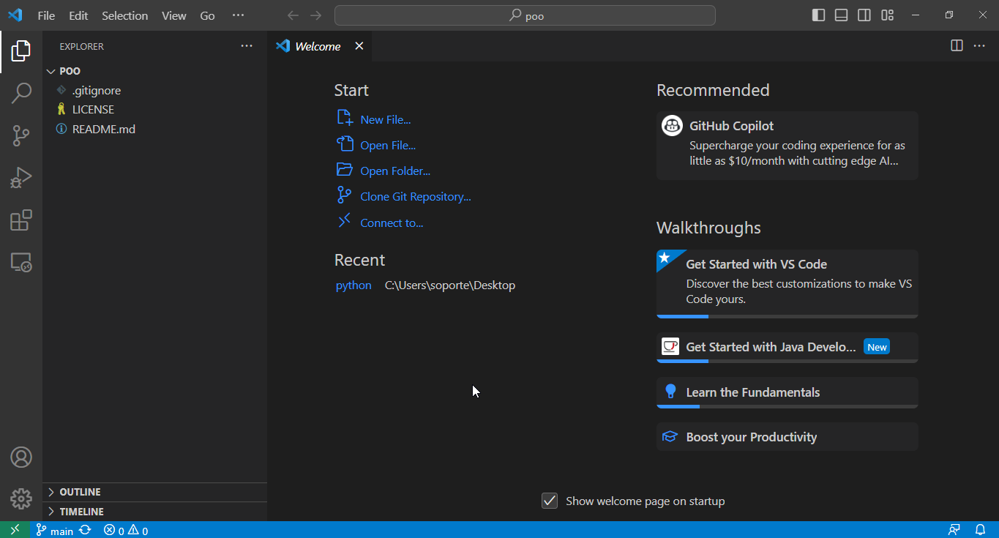

---

<!-- VSCode: Repositorio -->
<style scoped>
.texto:after {
    content: 'Clic en "main" parte inferior izquierda';
  }
</style>

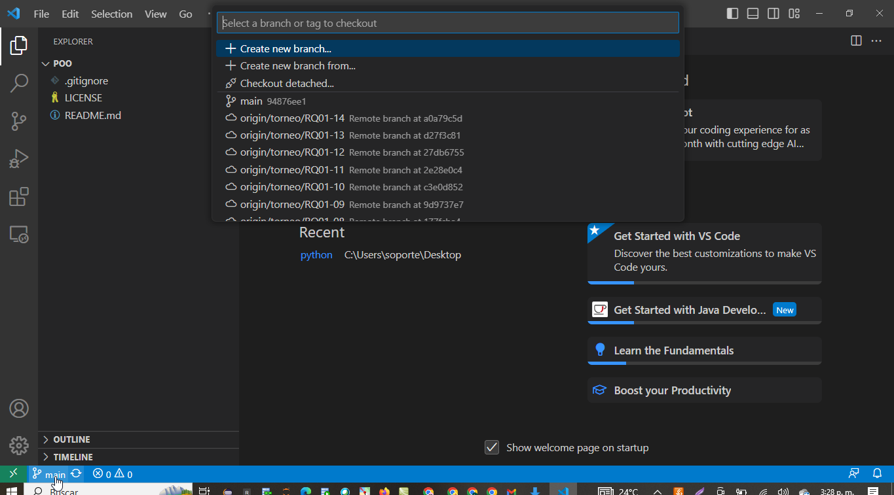

---

<!-- VSCode: Repositorio -->
<style scoped>
.texto:after {
    content: 'Seleccione "origin/torneo/RQ01-01';
  }
</style>

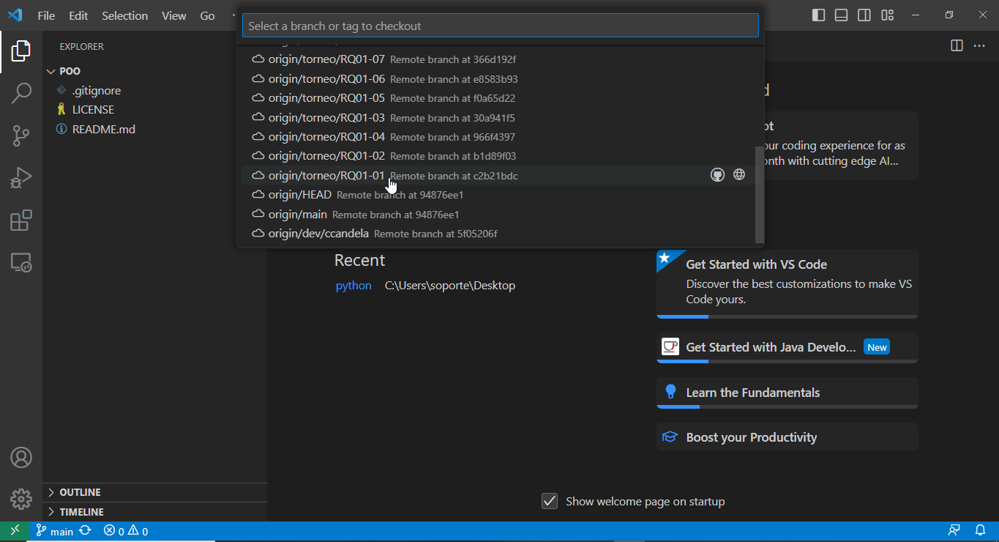

---

<!-- VSCode: Repositorio -->
<style scoped>
.texto:after {
    content: 'Explore "torneo-deportivo" en el lado izquierdo';
  }
</style>


---

<!-- VSCode: Repositorio -->
<style scoped>
.texto:after {
    content: 'Abra "presentacion.md" y el icono "Open Preview" (dos rectangulos con una lupa)';
  }
</style>

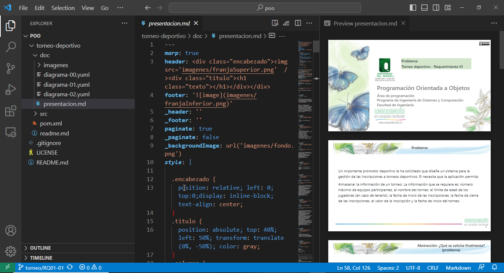

---

<!-- VSCode: Repositorio -->
<style scoped>
.texto:after {
    content: 'Clic en el icono de "Show Quick of Marp al lado de "Open Preview" para generar PDF';
  }
</style>

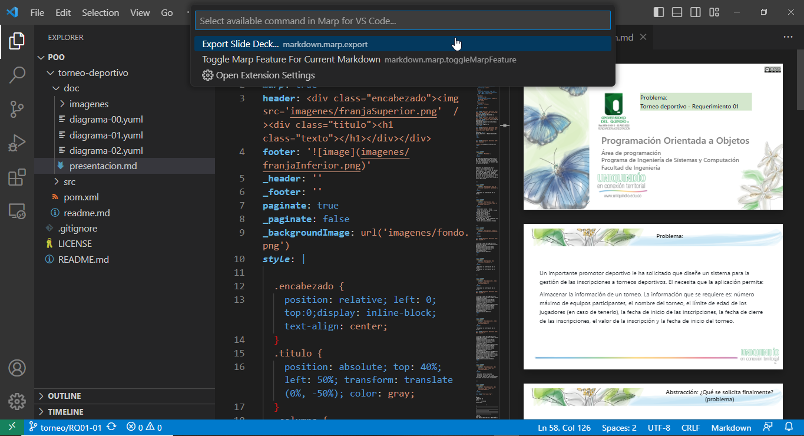

---

<!-- VSCode: Repositorio -->
<style scoped>
.texto:after {
    content: 'Para generar un PDF requiere tener instalado el navegador Chrome';
  }
</style>


---

<!-- VSCode: Repositorio -->
<style scoped>
.texto:after {
    content: 'Abra "diagrama 00.yuml"';
  }
</style>

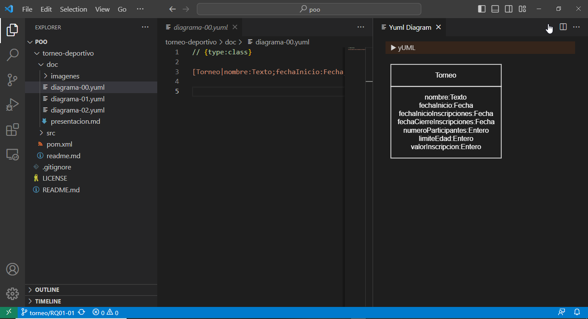


---

<!-- VSCode: Repositorio -->
<style scoped>
.texto:after {
    content: 'Abra "TorneoTest.java"';
  }
</style>

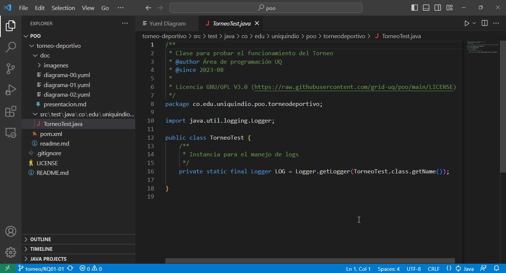

---

<!-- VSCode: Repositorio -->
<style scoped>
.texto:after {
    content: 'Cierre la carpeta "Close Folder" para terminar';
  }
</style>

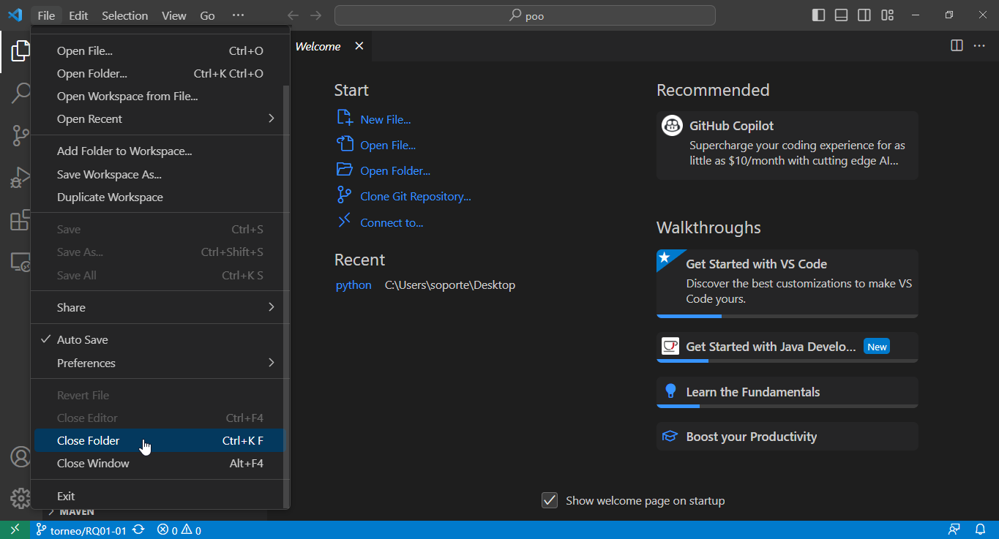

---
<!-- 
_header: ''
_footer: '' 
_paginate: false
_backgroundImage: url('imagenes/gracias.png')
-->
