
<h1 style="color: gray">Programación Orientada a Objetos</h1>

<h5 style="color: gray">Área de programación 
Programa de Ingeniería de Sistemas y Computación 
Facultad de Ingeniería
</h5>

<b>
<h2>Creando un nuevo proyecto</h2>
</b>

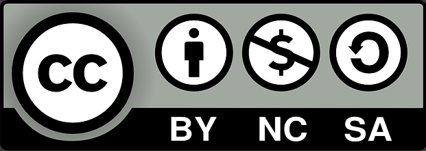

---

<!--  -->

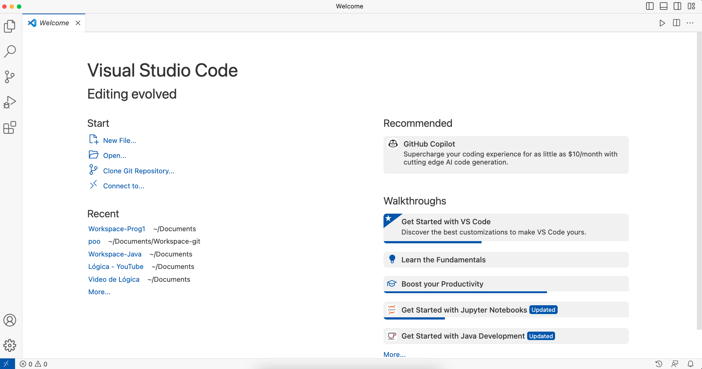

---

<!--  -->

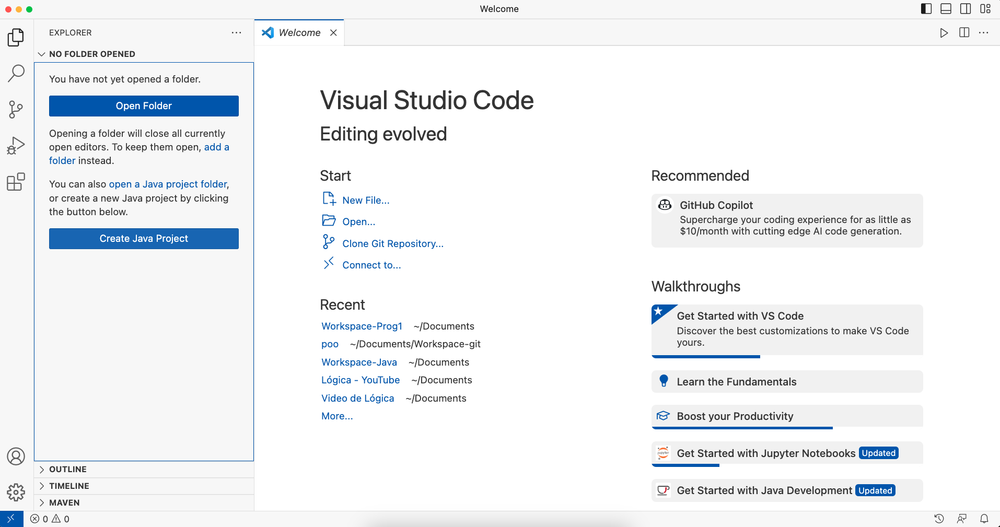

---

<!-- Arquetipo MAVEN -->

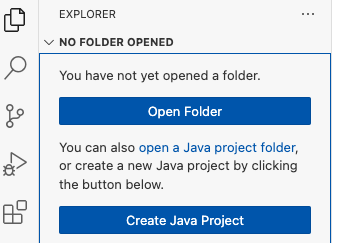

---

<!-- Arquetipo MAVEN -->

---

<!-- Arquetipo MAVEN -->

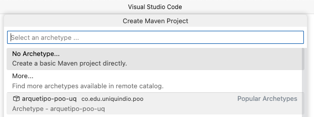

---

<!-- Arquetipo MAVEN -->

---

<!-- Arquetipo MAVEN -->

---

<!-- Arquetipo MAVEN -->

---

<!-- Arquetipo MAVEN -->

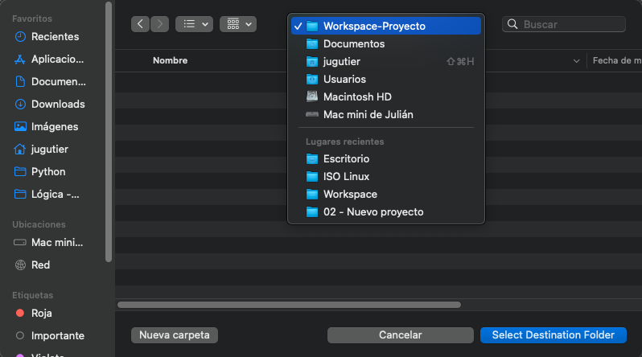

---

<!-- Arquetipo MAVEN -->

---

<!-- Arquetipo MAVEN -->

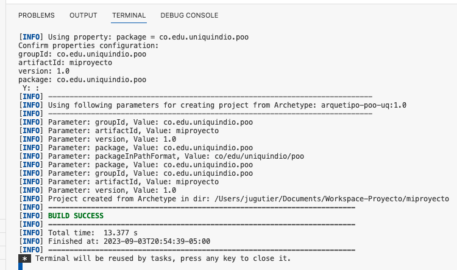

---

<!-- Arquetipo MAVEN -->

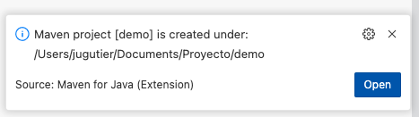

---

<!-- Arquetipo MAVEN -->

---

<!-- Arquetipo MAVEN -->

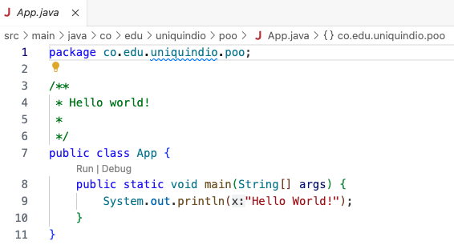

---

<!-- Arquetipo MAVEN -->

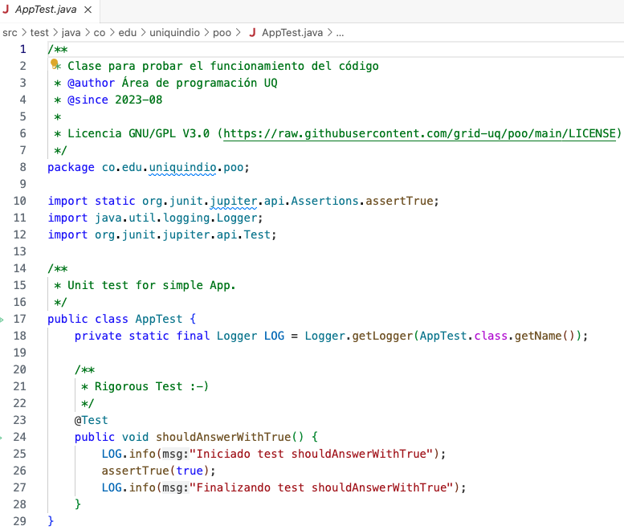

---

<!-- Arquetipo MAVEN -->

---

<!--  -->

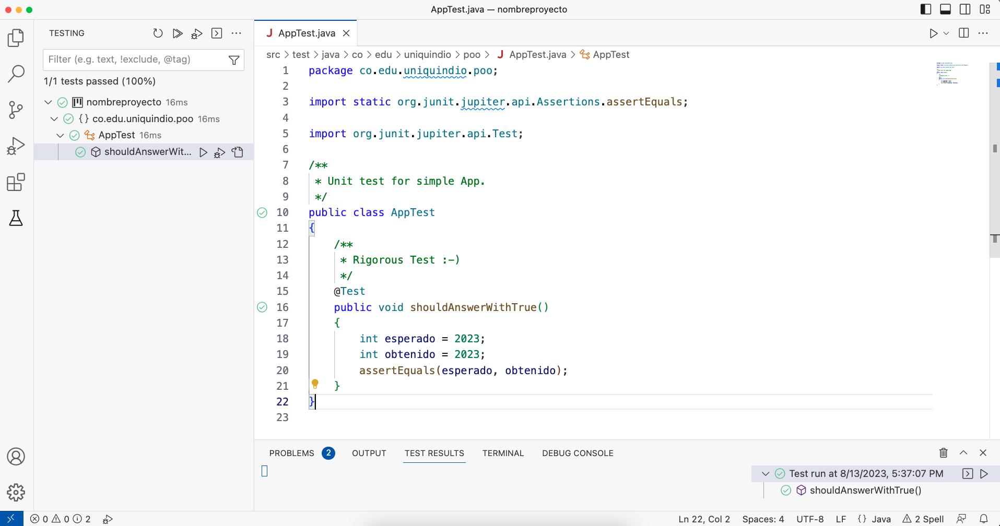

---

<!--  -->

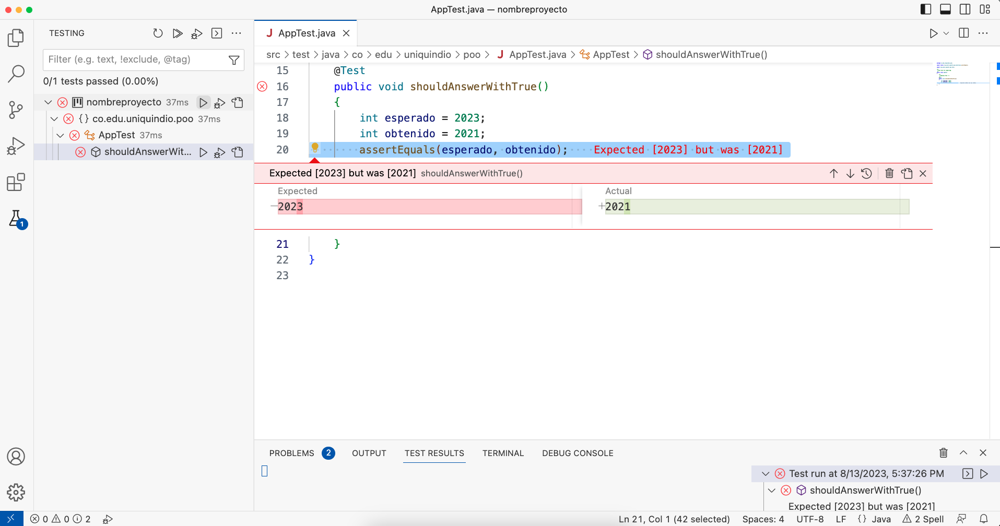

---

<!-- Arquetipo MAVEN -->

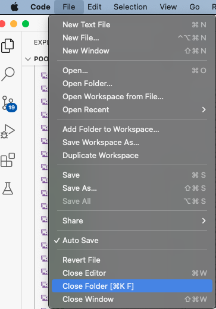

---

<!-- 
_header: ''
_footer: '' 
_paginate: false
_backgroundImage: url('imagenes/gracias.png')
-->
