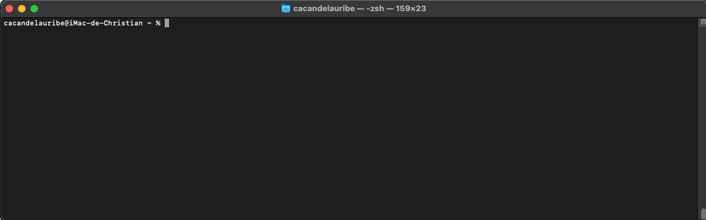
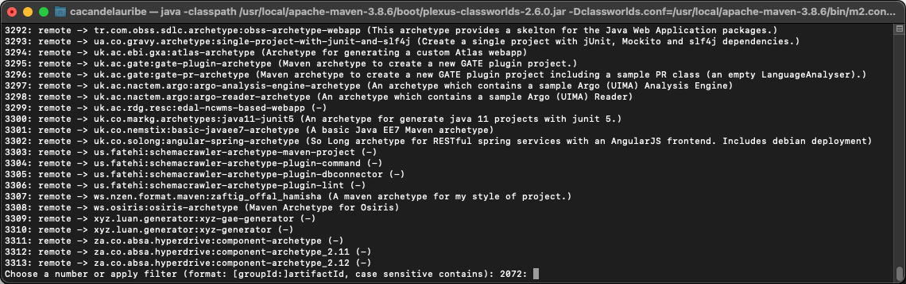
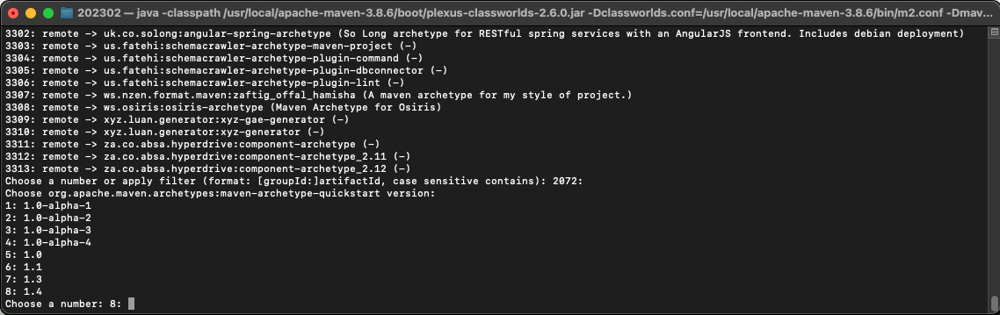
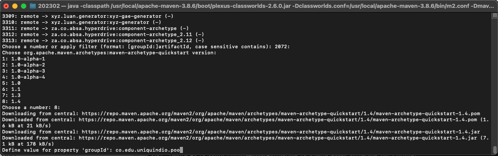
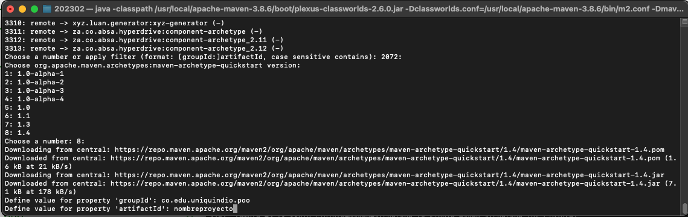
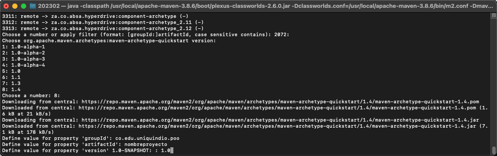
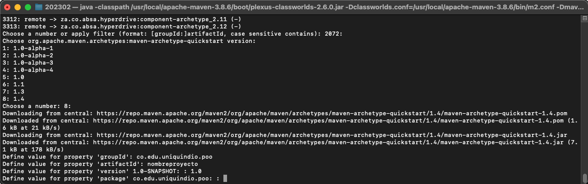
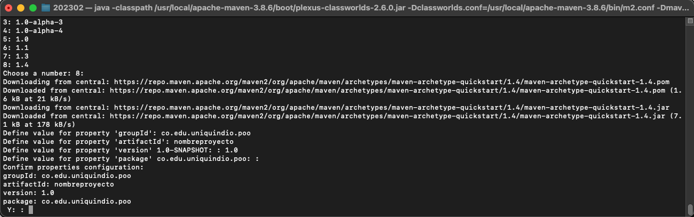
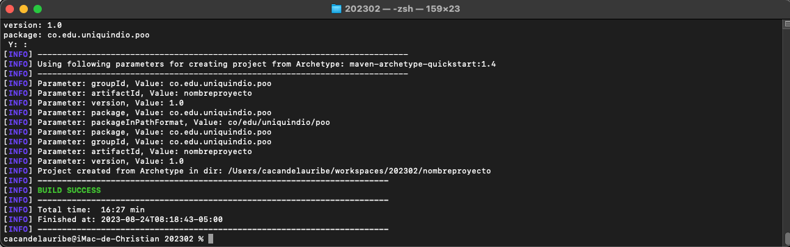

<div style="position: absolute; left: 30%; top:45%; width: 70%; text-align: left"><h1 style="color: gray">Programación Orientada a Objetos</h1></div>
<div style="position: absolute; left: 30%; top:55%; width: 70%; text-align: left"><h5 style="color: gray">Área de programación<br />
Programa de Ingeniería de Sistemas y Computación<br />
Facultad de Ingeniería
</h5></div>

<div style="position: absolute; left: 45%; top:20%; background-color: rgb(212, 231, 205); width: 550px; display:table-cell; text-align: center; padding: 30px 0;">
<b>
<h2>Creando un nuevo proyecto desde la terminal</h2>

</b>
</div>


<div style="position: absolute; left: 93%; top:10px; ">


</div>

---

<!--  -->
<style scoped>
.texto:after {
    content: 'Abra una terminal (power shell en windows)';
  }
</style>

 



---

<!--  -->
<style scoped>
.texto:after {
    content: 'Listar las plantillas';
  }
</style>

```shell
mvn archetype:generate
```


Al presionar enter seleccionará el archetype por defecto 2072 (quick start).

---


<!--  -->
<style scoped>
.texto:after {
    content: 'Seleccione la Versión más actual, en este caso 1.4';
  }
</style>



Al presionar enter seleccionará la versión por defecto 8 (1.4)


---

<!--  -->
<style scoped>
.texto:after {
    content: 'Escriba el "group id" para el caso co.edu.uniquindio.poo';
  }
</style>



Tras ingresar el group id presione enter.

---

<!--  -->
<style scoped>
.texto:after {
    content: 'Escriba el nombre del proyecto, por ejemplo "nombreproyecto"';
  }
</style>



Tras ingresar el nombre del proyecto (artifact id) presione enter.

---


<!--  -->
<style scoped>
.texto:after {
    content: 'Ingrese la versión del proyecto, por ejemplo 1.0';
  }
</style>



Tras ingresar la versión del proyecto presione enter.

---

<!--  -->
<style scoped>
.texto:after {
    content: 'Acepte la creación del paquete "co.edu.uniquindio.poo"';
  }
</style>



Al presionar enter aceptara el paquete por defecto (co.edu.uniquindio.poo)


---

<!--  -->
<style scoped>
.texto:after {
    content: 'Confirme los datos de creación';
  }
</style>



Al presionar enter confirmará los datos.

---

<!--  -->
<style scoped>
.texto:after {
    content: 'Proyecto creado';
  }
</style>



El proyecto ha sido creado, abralo en el Visual Studio Code.


---

<!--  -->
<style scoped>
.texto:after {
    content: 'Clic "Open Folder" en la opción  "EXPLORER" y seleccione la carpeta del proyecto';
  }
</style>


---

<!--  -->
<style scoped>
.texto:after {
    content: 'Observe al lado izquierdo (nombre del proyecto, carpeta src y un archivo pom.xml)';
  }
</style>


---

<!--  -->
<style scoped>
.texto:after {
    content: 'Dentro de la carpeta src está un ejemplo "App.java" y "AppTest.java"';
  }
</style>


---

<!--  -->
<style scoped>
.texto:after {
    content: '"App.java" es un ejemplo que imprime en pantalla "Hello World!"';
  }
</style>


---

<!--  -->
<style scoped>
.texto:after {
    content: 'Si lo desea lo puede ejecutar el ejemplo con el icono en forma triángulo parte superior derecha';
  }
</style>


---

<!--  -->
<style scoped>
.texto:after {
    content: '"AppTest.java" es un ejemplo de una prueba';
  }
</style>


---

<!--  -->
<style scoped>
.texto:after {
    content: 'Puede ejecutar la prueba usando el icono en forma de botella de laboratorio (a la izquierda y en el medio) y en el triángulo de la prueba';
  }
</style>


---

<!--  -->
<style scoped>
.texto:after {
    content: 'Observe el archivo de configuración del proyecto Maven (pom.xml)';
  }
</style>


---
<style scoped>
.texto:after {
    content: '';
  }
  section{
    font-size:20pt
  }
</style>


# Actualizando el archivo de configuración **pom.xml**


- Número de la versión a de Java que se utilizará, para nuestro caso, 17.

- Cambiar la versión del componente de pruebas a **JUnit Jupiter**.

  - Actualizar el ejemplo de la prueba a la nueva versión

- Elimine los *plugins* que no usaremos, dejando solamente:
  - *maven-compiler-plugin* (utilizado para compilar el proyecto) v. 3.11.0
    <div style="font-size:12pt">

    https://mvnrepository.com/artifact/org.apache.maven.plugins/maven-compiler-plugin
    </div>

  - *maven-surefire-plugin* (utilizado para ejecutar las pruebas) v. 3.1.2
    <div style="font-size:12pt">

    https://mvnrepository.com/artifact/org.apache.maven.plugins/maven-surefire-plugin
    </div>

---

<!--  -->
<style scoped>
.texto:after {
    content: 'Actualice el número de la versión de Java a utilizar, para nosotros será 17';
  }
</style>


---

<!--  -->
<style scoped>
.texto:after {
    content: 'Busque en Internet "junit-jupiter maven"';
  }
</style>


---

<!--  -->
<style scoped>
.texto:after {
    content: 'Clic en la última versión, para el caso 5.10.0';
  }
</style>


---

<!--  -->
<style scoped>
.texto:after {
    content: 'Seleccione y copie las líneas para la configuración Maven ';
  }
</style>


---

<!--  -->
<style scoped>
.texto:after {
    content: 'Elimine del archivo pom.xml la dependencia junit 4.11';
  }
</style>


---

<!--  -->
<style scoped>
.texto:after {
    content: 'Pegue en el mismo lugar del archivo pom.xml las líneas que copió de Internet junit-jupiter';
  }
</style>


---

<!--  -->
<style scoped>
.texto:after {
    content: 'Seleccione "Always" para sincronizar los cambios en el proyecto';
  }
</style>


---

<!--  -->
<style scoped>
.texto:after {
    content: 'Deje los plugins que utilizaremos y actualice la versión según la imágen';
  }
</style>


---

<!--  -->
<style scoped>
.texto:after {
    content: 'Ajuste el archivo de la prueba para nueva versión';
  }
</style>


---

<!--  -->
<style scoped>
.texto:after {
    content: 'Ejecute nuevamente la prueba';
  }
</style>


---


<!--  -->
<style scoped>
.texto:after {
    content: 'Modifique la prueba con este ejemplo';
  }
</style>


---

<!--  -->
<style scoped>
.texto:after {
    content: 'Finalmente haga que la prueba falle usando un valor diferente para la variable obtenido';
  }
</style>


---

<!-- 
_header: ''
_footer: '' 
_paginate: false
_backgroundImage: url('imagenes/gracias.png')
-->
