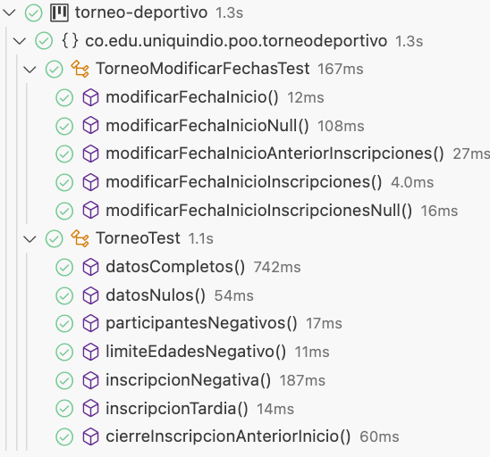

<div style="position: absolute; left: 30%; top:45%; width: 70%; text-align: left"><h1 style="color: gray">Programación Orientada a Objetos</h1></div>
<div style="position: absolute; left: 30%; top:55%; width: 70%; text-align: left"><h5 style="color: gray">Área de programación<br />
Programa de Ingeniería de Sistemas y Computación<br />
Facultad de Ingeniería
</h5></div>

<div style="position: absolute; left: 45%; top:20%; background-color: rgb(212, 231, 205); width: 550px">
<b>
Problema: <br />
Torneo deportivo - Requerimiento 01 <br />
</b>
</div>


<div style="position: absolute; left: 93%; top:10px; ">


</div>

---


<style >
.texto:after {
    content: 'Problema:';
  }
</style>

Un importante promotor deportivo le ha solicitado que diseñe un sistema para la gestión de las inscripciones a torneos deportivos. El necesita que la aplicación permita:

---

## RQ 01

Almacenar la información de un torneo. La información que se requiere es: número máximo de equipos participantes, el nombre del torneo, el límite de edad de los jugadores (en caso de tenerlo), la fecha de inicio de las inscripciones, la fecha de cierre de las inscripciones, el valor de la inscripción y la fecha de inicio del torneo.

---
## RQ 02

Debido a la planeación de los torneos en ocasiones es necesario modificar las fechas de inscripción e inicio del mismo. Por lo anterior, el promotor solicita que exista la posibilidad de poder modificar dichos datos después de su creación. 

---
## RQ 03

Se desea incluir entre la información del torneo, el tipo de torneo según si es de carácter local, regional, nacional o mundial. 

---

## RQ 04

Se desea incluir los equipos que participaran en el torneo, para lo cual se requiere una forma de registrar cada uno de los equipos. Cada equipo se espera conocer el nombre del equipo y su representante de quien se requiere su nombre, apellido, email y número de celular. Durante el registro se debe tener en cuenta que no debe excederse el número máximo de equipos y que la inscripción se realice dentro de las fechas permitidas. Así mismo, no se permiten dos equipos con el mismo nombre en el torneo. 

---

<style scoped>
.texto:after {
    content: 'Abstracción: ¿Qué se solicita finalmente? (problema)';
  }
</style>

- Almacenar la información de un torneo
- Modificar fechas de inscripción e inicio del torneo
- Realizar inscripción de equipos para el torneo


---

<style scoped>
.texto:after {
    content: 'Abstracción: ¿Qué información es relevante dado el problema anterior?';
  }
</style>

- nombre del torneo : Texto
- fecha de inicio del torneo : Fecha
- fecha de inicio de las inscripciones : Fecha
- fecha de cierre de las inscripciones : Fecha
- número máximo de equipos participantes : Entero
- límite de edad de los jugadores (en caso de tenerlo) : Entero 
- valor de la inscripción : Entero
- tipo de torneo: Tipo de Torneo (local, regional, nacional o mundial)


---

<style scoped>
.texto:after {
    content: 'Abstracción: ¿Qué información es relevante dado el problema anterior?';
  }
</style>

- nombre del equipo 
- nombre del representante
- apellido del representante
- email del representante
- número de celular del representante

---
<style scoped>
.texto:after {
    content: 'Abstracción: ¿Cómo se agrupa la información relevante?';
  }
</style>

- Torneo
- TipoTorneo
- Equipo
- Representante

<div style="position: absolute; left: 40%; top:30%; ">


</div>

---


<style scoped>
.texto:after {
    content: 'Abstracción: ¿Qué solicitan finalmente?';
  }
</style>

- Almacenar la información de un torneo
- Recuperar la información de un torneo
- Modificar las fechas de inscripción e inicio del torneo
- Almacenar la información de los equipos y su representante
  - Validar que no se debe excederse el número máximo de equipos
  - Validar que la inscripción se realice dentro de las fechas permitidas
  - Validar que no se permita registrar un equipo con el mismo nombre de uno ya registrado
- Recuperar la información de los equipos y su representante

---


<style scoped>
.texto:after {
    content: 'Descomposición: ¿Cómo se distribuyen las funcionalidades?';
  }
</style>

- Almacenar la información de un torneo

<div style="position: absolute; left: 50%; top:30%; ">


;+registrarTorneo(torneo:Torneo)]*tipoTorneo-1>[<<Enum>>;TipoTorneo|LOCAL;REGIONAL;NACIONAL;MUNDIAL],[Torneo]<>1equipos-*>[Equipo|nombre:Texto],[Equipo]<>1representante-1>[Representante|nombre:Texto;apellido:Texto;email:Texto;celular:Texto])
</div>

---


<style scoped>
.texto:after {
    content: 'Descomposición: ¿Cómo se distribuyen las funcionalidades?';
  }
</style>

- Recuperar la información de un torneo

<div style="position: absolute; left: 60%; top:15%; ">


;+getNombre():Texto;+getFechaInicio():Fecha;+getFechaInicioInscripciones():Fecha;+getFechaCierreInscripciones():Fecha;+getNumeroParticipantes():Entero;+getLimiteEdad():Entero;+getValorInscripcion():Entero;+getTipoTorneo():TipoTorneo]*tipoTorneo-1>[<<Enum>>;TipoTorneo|LOCAL;REGIONAL;NACIONAL;MUNDIAL])
</div>

---


<style scoped>
.texto:after {
    content: 'Descomposición: ¿Cómo se distribuyen las funcionalidades?';
  }
</style>

- Modificar las fechas de inscripción e inicio 
del torneo

<div style="position: absolute; left: 60%; top:15%; ">


;+getNombre():Texto;+getFechaInicio():Fecha;+getFechaInicioInscripciones():Fecha;+getFechaCierreInscripciones():Fecha;+getNumeroParticipantes():Entero;+getLimiteEdad():Entero;+getValorInscripcion():Entero;+getTipoTorneo():TipoTorneo;+setFechaInicio(fechaInicio:Fecha);+setFechaInicioInscripciones(fechaInicioInscripciones:Fecha);+setFechaCierreInscripciones(fechaCierreInscripciones:Fecha)]*tipoTorneo-1>[<<Enum>>;TipoTorneo|LOCAL;REGIONAL;NACIONAL;MUNDIAL])
</div>

---

<style scoped>
.texto:after {
    content: 'Descomposición: ¿Qué debo hacer para probar las funcionalidades?';
  }
</style>

- Almacenar datos de prueba
- Recuperar los datos de prueba
- Verificar que los datos almacenados coinciden con los datos recuperados
- Modificar datos de la prueba
- Recuperar datos de la prueba
- Verificar que los datos almacenados y modificados coinciden con los datos recuperados


---


<style scoped>
.texto:after {
    content: 'Descomposición: ¿Qué debo hacer para probar las funcionalidades?';
  }
</style>

<div style="font-size: 9pt">
<!-- https://www.tablesgenerator.com/markdown_tables -->

| Prueba                                | Entrada de datos                                          | Salida (Resultado)                                                                                  |
|---------------------------------------|-----------------------------------------------------------|-----------------------------------------------------------------------------------------------------|
| Datos Completos                       | Copa Mundo\|2023-10-01\| 2023-08-01\|2023-09-15\|24\|0\|0\|LOCAL | Torneo creado con los datos proporcionados Copa Mundo\|2023-10-01\|2023-08-01\|2023-09-15\|24\|0\|0\|LOCAL |
| Con datos nullos                      | null\|null\|null\|null\|24\|0\|0\|null                          | Error, faltan datos para la creación del torneo                                                     |
| Participantes negativos               | Copa Mundo\|2023-10-01\|2023-08-01\|2023-09-15\|-24\|0\|0\|LOCAL | Error: porque no se puede crear un torneo con número negativo de participantes                      |
| Limite edad negativo                  | Copa Mundo\|2023-10-01\|2023-08-01\|2023-09-15\|24\|-1\|0\|LOCAL | Error: porque no se puede crear un torneo con número negativo en el límite de edad                  |
| Inscripción negativa                  | Copa Mundo\|2023-10-01\|2023-08-01\|2023-09-15\|24\|0\|-1\|LOCAL | Error: porque no se puede crear un torneo con número negativo en la inscripción                     |
| Fechas Inscripción tardías            | Copa Mundo\|2023-10-01\|2023-11-01\|2023-11-15\|24\|0\|0\|LOCAL  | Error: Las inscripciones no pueden ser posteriores al inicio del torneo                             |
| Cierre inscripción anterior al inicio | Copa Mundo\|2023-10-01\|2023-08-15\|2023-08-01\|24\|0\|0\|LOCAL  | Error: El cierre de las inscripciones no puede ser anterior al inicio de las inscripciones.         |

</div>

---


<style scoped>
.texto:after {
    content: 'Descomposición: ¿Qué debo hacer para probar las funcionalidades?';
  }
</style>

<div style="font-size: 9pt">
<!-- https://www.tablesgenerator.com/markdown_tables -->

| Prueba                                | Entrada de datos                                          | Salida (Resultado)                                                                                  |
|---------------------------------------|-----------------------------------------------------------|-----------------------------------------------------------------------------------------------------|
| Modificar fecha inicio, valido | Copa Mundo\|2023-10-01\| 2023-08-01\|2023-09-15\|24\|0\|0\|LOCAL  <br/> Nueva fecha de inicio 2023-10-12 | Torneo creado con los datos proporcionados Copa Mundo\|2023-10-01\|2023-08-01\|2023-09-15\|24\|0\|0\|LOCAL   <br/> Torneo con los datos modificados Copa Mundo\|2023-10-12\|2023-08-01\|2023-09-15\|24\|0\|0\|LOCAL |
| Modificar fecha inicio, con null | Copa Mundo\|2023-10-01\| 2023-08-01\|2023-09-15\|24\|0\|0\|LOCAL  <br/>  Nueva fecha de inicio null      | Torneo creado con los datos proporcionados Copa Mundo\|2023-10-01\|2023-08-01\|2023-09-15\|24\|0\|0\|LOCAL  <br/>  Error la fecha de inicio no puede ser null                                               |
| Modificar fecha inicio, con fecha de inicio anterior a las inscripciones | Copa Mundo\|2023-10-01\| 2023-08-01\|2023-09-15\|24\|0\|0\|LOCAL  Nueva fecha de inicio 2023-07-01 | Torneo creado con los datos proporcionados Copa Mundo\|2023-10-01\|2023-08-01\|2023-09-15\|24\|0\|0\|LOCAL  Error la fecha de inicio es anterior a las inscripciones                                 |
| Modificar fecha inicio de inscripciones, valido | Copa Mundo\|2023-10-01\| 2023-08-01\|2023-09-15\|24\|0\|0\|LOCAL  <br/> Nueva fecha de inicio de inscripciones 2023-08-10 | Torneo creado con los datos proporcionados Copa Mundo\|2023-10-01\|2023-08-01\|2023-09-15\|24\|0\|0\|LOCAL   <br/> Torneo con los datos modificados Copa Mundo\|2023-10-01\|2023-08-10\|2023-09-15\|24\|0\|0\|LOCAL |
| Modificar fecha inicio de inscripciones con null | Copa Mundo\|2023-10-01\| 2023-08-01\|2023-09-15\|24\|0\|0\|LOCAL  <br/>  Nueva fecha de inicio de inscripciones null      | Torneo creado con los datos proporcionados Copa Mundo\|2023-10-01\|2023-08-01\|2023-09-15\|24\|0\|0\|LOCAL  <br/>  Error la fecha de inicio de inscripciones no puede ser null                                               |


</div>

---

<style scoped>
.texto:after {
    content: 'Descomposición: ¿Qué debo hacer para probar las funcionalidades?';
  }
</style>

<div style="font-size: 9pt">
<!-- https://www.tablesgenerator.com/markdown_tables -->

| Prueba                                | Entrada de datos                                          | Salida (Resultado)                                                                                  |
|---------------------------------------|-----------------------------------------------------------|-----------------------------------------------------------------------------------------------------|
| Modificar fecha inicio de inscripciones con fecha de inicio posterior a la fecha de cierre de inscripciones | Copa Mundo\|2023-10-01\| 2023-08-01\|2023-09-15\|24\|0\|0\|LOCAL  Nueva fecha de inicio de inscripciones 2023-09-16 | Torneo creado con los datos proporcionados Copa Mundo\|2023-10-01\|2023-08-01\|2023-09-15\|24\|0\|0\|LOCAL  Error la fecha de inicio de inscripciones no puede ser posterior a la fecha de cierre                                  |
| Modificar fecha de cierre de inscripciones, valido | Copa Mundo\|2023-10-01\| 2023-08-01\|2023-09-15\|24\|0\|0\|LOCAL  <br/> Nueva fecha de cierre de inscripciones 2023-09-16 | Torneo creado con los datos proporcionados Copa Mundo\|2023-10-01\|2023-08-01\|2023-09-15\|24\|0\|0\|LOCAL   <br/> Torneo con los datos modificados Copa Mundo\|2023-10-01\|2023-08-10\|2023-09-16\|24\|0\|0\|LOCAL |
| Modificar fecha de cierre de inscripciones con null | Copa Mundo\|2023-10-01\| 2023-08-01\|2023-09-15\|24\|0\|0\|LOCAL  <br/>  Nueva fecha de cierre de inscripciones null      | Torneo creado con los datos proporcionados Copa Mundo\|2023-10-01\|2023-08-01\|2023-09-15\|24\|0\|0\|LOCAL  <br/>  Error la fecha de cierre de inscripciones no puede ser null                                               |
| Modificar fecha de cierre de inscripciones con fecha posterior a la fecha de inicio del torneo | Copa Mundo\|2023-10-01\| 2023-08-01\|2023-09-15\|24\|0\|0\|LOCAL  Nueva fecha de cierre de inscripciones 2023-10-02 | Torneo creado con los datos proporcionados Copa Mundo\|2023-10-01\|2023-08-01\|2023-09-15\|24\|0\|0\|LOCAL  Error la fecha de cierre de inscripciones no puede ser posterior a la fecha de inicio del torneo                                  |
| Modificar fecha de cierre de inscripciones con fecha anterior a la fecha de inicio de inscripciones | Copa Mundo\|2023-10-01\| 2023-08-01\|2023-09-15\|24\|0\|0\|LOCAL  Nueva fecha de cierre de inscripciones 2023-07-30 | Torneo creado con los datos proporcionados Copa Mundo\|2023-10-01\|2023-08-01\|2023-09-15\|24\|0\|0\|LOCAL  Error la fecha de cierre de inscripciones no puede ser anterior a la fecha de inicio de inscripciones                                  |

</div>

---

<style scoped>
.texto:after {
    content: 'Reconocimiento de patrones: ¿Qué puede reutilizar?';
  }
</style>

- No aplica


---

<style scoped>
.texto:after {
    content: 'Codificación: ';
  }
</style>

<h1>Usando una clase</h1>

Constructor con todos los atributos + métodos gets y 
sets


<div style="position: absolute; left: 60%; top:15%; ">


;+getNombre():Texto;+getFechaInicio():Fecha;+getFechaInicioInscripciones():Fecha;+getFechaCierreInscripciones():Fecha;+getNumeroParticipantes():Entero;+getLimiteEdad():Entero;+getValorInscripcion():Entero;+getTipoTorneo():TipoTorneo;+setFechaInicio(fechaInicio:Fecha);+setFechaInicioInscripciones(fechaInicioInscripciones:Fecha);+setFechaCierreInscripciones(fechaCierreInscripciones:Fecha);+setTipoTorneo(tipoTorneo:TipoTorneo)]*tipoTorneo-1>[<<Enum>>;TipoTorneo|LOCAL;REGIONAL;NACIONAL;MUNDIAL])
</div>

---

<style scoped>
.texto:after {
    content: 'Codificación: ¿Cómo pruebo la solución en JAVA?';
  }
</style>

```java
/**
* Clase para probar el funcionamiento del Torneo
* @author Área de programación UQ
* @since 2023-08
*
* Licencia GNU/GPL V3.0 (https://www.gnu.org/licenses/lgpl-3.0.html#license-text)
*/
package co.edu.uniquindio.poo.torneodeportivo;
import static org.junit.jupiter.api.Assertions.assertEquals;
import static org.junit.jupiter.api.Assertions.assertTrue;
import java.time.LocalDate;
import java.util.logging.Logger;
import org.junit.jupiter.api.Test;

public class TorneoTest {
   /**
    * Instacia para el menejo de logs
    */
   private static final Logger LOG = Logger.getLogger(TorneoTest.class.getName());
}
```


---


<style scoped>
.texto:after {
    content: 'Codificación: ¿Cómo pruebo la solución en JAVA?';
  }
</style>

```java
   /**
    * Verificar que la clase Torneo almacene y recupere los datos
    *
    */
   @Test
   public void datosCompletos() {
       LOG.info("Inicio de prueba datos completos...");
       // Almacenar los datos de prueba Copa Mundo|2023-10-01|2023-08-01|2023-09-15|24|0|0|LOCAL
       // ERROR: Esta linea falla porque no se ha incluido el atributo tipo torneo en Torneo y no se ha creado la enumeración TipoTorneo
       Torneo torneo = new Torneo("Copa Mundo", LocalDate.of(2023, 10, 1), LocalDate.of(2023, 8, 1), LocalDate.of(2023, 9, 15), (byte)24, (byte)0, 0,TipoTorneo.LOCAL);

       // Recuperación y verificación de datos
       assertEquals("Copa Mundo",torneo.getNombre());
       assertEquals(LocalDate.of(2023, 10, 1),torneo.getFechaInicio());
       assertEquals(LocalDate.of(2023, 8, 1),torneo.getFechaInicioInscripciones());
       assertEquals(LocalDate.of(2023, 9, 15),torneo.getFechaCierreInscripciones());
       assertEquals((byte)24,torneo.getNumeroParticipantes());
       assertEquals((byte)0,torneo.getLimiteEdad());
       assertEquals(0,torneo.getValorInscripcion());
       assertEquals(TipoTorneo.LOCAL,torneo.getTipoTorneo())
       LOG.info("Fin de prueba datos completos...");
   }
```


---

<style scoped>
.texto:after {
    content: 'Codificación: ¿Cómo pruebo la solución en JAVA?';
  }
</style>

```java
    /**
     * Verificar que la clase Torneo valide que se ingrese los datos
     * 
     */
    @Test
    public void datosNulos() {
        LOG.info("Inicio de prueba datos nulos...");
        // Almacenar los datos de prueba null|null|null|null|24|0|0|null
        // Error porque no existe constructor con el parámetro tipo de torneo
        assertThrows(Throwable.class, ()-> new Torneo(null, null, null, null, (byte)24, (byte)0, 0,null));
        
        
        LOG.info("Fin de prueba datos nulos...");
    }
```


---

<style scoped>
.texto:after {
    content: 'Codificación: ¿Cómo pruebo la solución en JAVA?';
  }
</style>

```java
    /**
     * Verificar que la clase Torneo valide que el ingreso de número 
     * de participantes negativo 
     * 
     */
    @Test
    public void participantesNegativos() {
        LOG.info("Inicio de prueba número de participantes negativo...");
        // Almacenar los datos de prueba Copa Mundo|2023-10-01|2023-08-01|2023-09-15|-24|0|0|LOCAL
        // Error porque no existe constructor con el parámetro tipo de torneo
        assertThrows(Throwable.class, ()-> new Torneo("Copa Mundo", LocalDate.of(2023, 10, 1), 
              LocalDate.of(2023, 8, 01), LocalDate.of(2023, 10, 15), (byte)-24, (byte)0, 0,TipoTorneo.LOCAL));
        
        LOG.info("Fin de prueba  número de participantes negativo...");
    }
```


---

<style scoped>
.texto:after {
    content: 'Codificación: ¿Cómo pruebo la solución en JAVA?';
  }
</style>

```java
    /**
     * Verificar que la clase Torneo valide que el 
     * ingreso de limites de edades negativo 
     * 
     */
    @Test
    public void limiteEdadesNegativo() {
        LOG.info("Inicio de prueba limites de edades negativo...");
        // Almacenar los datos de prueba Copa Mundo|2023-10-01|2023-08-01|2023-09-15|24|-1|0|LOCAL
        // Error porque no existe constructor con el parámetro tipo de torneo
        assertThrows(Throwable.class, ()-> new Torneo("Copa Mundo", LocalDate.of(2023, 10, 1), 
              LocalDate.of(2023, 8, 01), LocalDate.of(2023, 10, 15), (byte)24, (byte)-1, 0,TipoTorneo.LOCAL));
        
        LOG.info("Fin de prueba  limites de edades negativo...");
    }
```


---

<style scoped>
.texto:after {
    content: 'Codificación: ¿Cómo pruebo la solución en JAVA?';
  }
</style>

```java
    /**
     * Verificar que la clase Torneo valide que el 
     * ingreso de valor de inscripción negativa
     * 
     */
    @Test
    public void inscripcionNegativa() {
        LOG.info("Inicio de prueba inscripción negativa...");
        // Almacenar los datos de prueba Copa Mundo|2023-10-01|2023-08-01|2023-09-15|24|0|-1|LOCAL
        // Error porque no existe constructor con el parámetro tipo de torneo
        assertThrows(Throwable.class, ()-> new Torneo("Copa Mundo", LocalDate.of(2023, 10, 1), 
              LocalDate.of(2023, 8, 01), LocalDate.of(2023, 10, 15), (byte)24, (byte)0, -1,TipoTorneo.LOCAL));
        
        LOG.info("Fin de prueba inscripción negativa...");
    }
```


---

<style scoped>
.texto:after {
    content: 'Codificación: ¿Cómo pruebo la solución en JAVA?';
  }
</style>

```java
    /**
     * Verificar que la clase Torneo valide que el 
     * ingreso de inscripciones posteriores a la fecha de inicio del torneo
     * 
     */
    @Test
    public void inscripcionTardia() {
        LOG.info("Inicio de prueba inscripción tardia...");
        // Almacenar los datos de prueba Copa Mundo|2023-10-01|2023-11-01|2023-11-15|24|0|0|LOCAL
        // Error porque no existe constructor con el parámetro tipo de torneo
        assertThrows(Throwable.class, ()-> new Torneo("Copa Mundo", LocalDate.of(2023, 10, 1), 
              LocalDate.of(2023, 11, 01), LocalDate.of(2023, 11, 15), (byte)24, (byte)0, 0,TipoTorneo.LOCAL));
        
        LOG.info("Fin de prueba inscripción tardia...");
    }

```

---


<style scoped>
.texto:after {
    content: 'Codificación: ¿Cómo pruebo la solución en JAVA?';
  }
</style>

```java
    /**
     * Verificar que la clase Torneo valide que el ingreso 
     * de inicio inscripciones posteriores a la fecha 
     * de cierre de inscripciones
     * 
     */
    @Test
    public void cierreInscripcionAnteriorInicio() {
        LOG.info("Inicio de prueba Cierre inscripción anterior al inicio...");
        // Almacenar los datos de prueba Copa Mundo|2023-10-01|2023-11-01|2023-11-15|24|0|0|LOCAL
        // Error porque no existe constructor con el parámetro tipo de torneo
        assertThrows(Throwable.class, ()-> new Torneo("Copa Mundo", LocalDate.of(2023, 10, 1), 
              LocalDate.of(2023, 8, 15), LocalDate.of(2023, 8, 1), (byte)24, (byte)0, 0,TipoTorneo.LOCAL));
        
        LOG.info("Fin de prueba Cierre inscripción anterior al inicio...");
    }
```

---

<style scoped>
.texto:after {
    content: 'Codificación: ¿Cómo pruebo la solución en JAVA?';
  }
</style>

```java
/**
 * Clase para probar la modificación de fechas en el Torneo
 * @author Área de programación UQ
 * @since 2023-08
 * 
 * Licencia GNU/GPL V3.0 (https://raw.githubusercontent.com/grid-uq/poo/main/LICENSE) 
 */
package co.edu.uniquindio.poo.torneodeportivo;

import static org.junit.jupiter.api.Assertions.assertEquals;
import static org.junit.jupiter.api.Assertions.assertThrows;

import java.time.LocalDate;
import java.util.logging.Logger;

import org.junit.jupiter.api.Test;

public class TorneoModificarFechasTest {
    /**
     * Instancia para el manejo de logs
     */
    private static final Logger LOG = Logger.getLogger(TorneoModificarFechasTest.class.getName());
    

}

```

---


<style scoped>
.texto:after {
    content: 'Codificación: ¿Cómo pruebo la solución en JAVA?';
  }
</style>

```java
    /**
     * Verificar que la clase Torneo permita la modificación de la fecha de inicio 
     * 
     */
    @Test
    public void modificarFechaInicio() {
        LOG.info("Inicio de prueba modificar fecha de inicio valida...");
        // Almacenar los datos de prueba Copa Mundo|2023-10-01|2023-08-01|2023-09-15|24|0|0|LOCAL
        // Error porque no existe constructor con el parámetro tipo de torneo
        Torneo torneo = new Torneo("Copa Mundo", LocalDate.of(2023, 10, 1), LocalDate.of(2023, 8, 1), LocalDate.of(2023, 9, 15), (byte)24, (byte)0, 0,TipoTorneo.LOCAL);

        // Modificación de la fecha 
        torneo.setFechaInicio(LocalDate.of(2023, 10, 12));
        
        assertEquals(LocalDate.of(2023, 10, 12),torneo.fechaInicio());
        
        
        LOG.info("Fin de prueba modificar fecha de inicio valida...");
    }

```

---


<style scoped>
.texto:after {
    content: 'Codificación: ¿Cómo pruebo la solución en JAVA?';
  }
</style>

```java
    /**
     * Verificar que la clase Torneo no permita la modificación de 
     * la fecha de inicio con un null
     * 
     */
    @Test
    public void modificarFechaInicioNull() {
        LOG.info("Inicio de prueba modificar fecha de inicio null...");
        // Almacenar los datos de prueba Copa Mundo|2023-10-01|2023-08-01|2023-09-15|24|0|0|LOCAL
        // Error porque no existe constructor con el parámetro tipo de torneo
        Torneo torneo = new Torneo("Copa Mundo", LocalDate.of(2023, 10, 1), 
        LocalDate.of(2023, 8, 1), LocalDate.of(2023, 9, 15), (byte)24, (byte)0, 0,TipoTorneo.LOCAL);

        // Modificación de la fecha
        assertThrows(Throwable.class,()->torneo.setFechaInicio(null));
        
        LOG.info("Fin de prueba modificar fecha de inicio null...");
    }


```


---


<style scoped>
.texto:after {
    content: 'Codificación: ¿Cómo pruebo la solución en JAVA?';
  }
</style>

```java
    /**
     * Verificar que la clase Torneo no permita la modificación de 
     * la fecha de inicio con una fecha anterior a la de las inscripciones
     * 
     */
    @Test
    public void modificarFechaInicioAnteriorInscripciones() {
        LOG.info("Inicio de prueba modificar fecha de inicio anterior a inscripciones...");
        // Almacenar los datos de prueba Copa Mundo|2023-10-01|2023-08-01|2023-09-15|24|0|0|LOCAL
        // Error porque no existe constructor con el parámetro tipo de torneo
        Torneo torneo = new Torneo("Copa Mundo", LocalDate.of(2023, 10, 1), 
            LocalDate.of(2023, 8, 1), LocalDate.of(2023, 9, 15), (byte)24, (byte)0, 0,TipoTorneo.LOCAL);

        // Modificación de la fecha
        assertThrows(Throwable.class,()->torneo.setFechaInicio(LocalDate.of(2023, 7, 1)));
        
        LOG.info("Fin de prueba modificar fecha de inicio anterior a inscripciones...");
    }
```

---


<style scoped>
.texto:after {
    content: 'Codificación: ¿Cómo pruebo la solución en JAVA?';
  }
</style>

```java
    /**
     * Verificar que la clase Torneo permita la modificación de la fecha de inicio de inscripciones
     * 
     */
    @Test
    public void modificarFechaInicioInscripciones() {
        LOG.info("Inicio de prueba modificar fecha de inicio de inscripciones valida...");
        // Almacenar los datos de prueba Copa Mundo|2023-10-01|2023-08-01|2023-09-15|24|0|0|LOCAL
        // Error porque no existe constructor con el parámetro tipo de torneo
        Torneo torneo = new Torneo("Copa Mundo", LocalDate.of(2023, 10, 1), 
                        LocalDate.of(2023, 8, 1), LocalDate.of(2023, 9, 15), (byte)24, (byte)0, 0,TipoTorneo.LOCAL);

        // Modificación de la fecha
        torneo.setFechaInicioInscripciones(LocalDate.of(2023, 8, 10));
        
        assertEquals(LocalDate.of(2023, 8, 10),torneo.getFechaInicioInscripciones());
        
        
        LOG.info("Fin de prueba modificar fecha de inicio de inscripciones valida...");
    }
```

---

<style scoped>
.texto:after {
    content: 'Codificación: ¿Cómo pruebo la solución en JAVA?';
  }
</style>

```java


/**
 * Verificar que la clase Torneo no permita la modificación de la fecha de inicio 
 * de inscripciones con un null
 * 
 */
@Test
public void modificarFechaInicioInscripcionesNull() {
    LOG.info("Inicio de prueba modificar fecha de inicio de inscripciones null...");
    // Almacenar los datos de prueba Copa Mundo|2023-10-01|2023-08-01|2023-09-15|24|0|0|LOCAL
    // Error porque no existe constructor con el parámetro tipo de torneo
    Torneo torneo = new Torneo("Copa Mundo", LocalDate.of(2023, 10, 1), LocalDate.of(2023, 8, 1), 
                        LocalDate.of(2023, 9, 15), (byte)24, (byte)0, 0,TipoTorneo.LOCAL);

    // Modificación de la fecha
    assertThrows(Throwable.class,()->torneo.setFechaInicioInscripciones(null));
    
    LOG.info("Fin de prueba modificar fecha de inicio de inscripciones null...");
}

```

---

<style scoped>
.texto:after {
    content: 'Codificación: ¿Cómo pruebo la solución en JAVA?';
  }
</style>

```java


/**
 * Verificar que la clase Torneo no permita la modificación de la fecha de inicio 
 * de inscripciones con un null
 * 
 */
@Test
public void modificarFechaInicioInscripcionesNull() {
    LOG.info("Inicio de prueba modificar fecha de inicio de inscripciones null...");
    // Almacenar los datos de prueba Copa Mundo|2023-10-01|2023-08-01|2023-09-15|24|0|0
    Torneo torneo = new Torneo("Copa Mundo", LocalDate.of(2023, 10, 1), LocalDate.of(2023, 8, 1), 
                        LocalDate.of(2023, 9, 15), (byte)24, (byte)0, 0);

    // Modificación de la fecha
    assertThrows(Throwable.class,()->torneo.setFechaInicioInscripciones(null));
    
    LOG.info("Fin de prueba modificar fecha de inicio de inscripciones null...");
}

```

---


<style scoped>
.texto:after {
    content: 'Codificación: ¿Cómo escribo la solución en JAVA?';
  }
</style>

```java
package co.edu.uniquindio.poo.torneodeportivo;

public enum TipoTorneo {
    LOCAL,
    REGIONAL,
    NACIONAL,
    MUNDIAL
}

```

<div style="position: absolute; left: 68%; top:19%; ">


;+getNombre():Texto;+getFechaInicio():Fecha;+getFechaInicioInscripciones():Fecha;+getFechaCierreInscripciones():Fecha;+getNumeroParticipantes():Entero;+getLimiteEdad():Entero;+getValorInscripcion():Entero;+getTipoTorneo():TipoTorneo;+setFechaInicio(fechaInicio:Fecha);+setFechaInicioInscripciones(fechaInicioInscripciones:Fecha);+setFechaCierreInscripciones(fechaCierreInscripciones:Fecha);+setTipoTorneo(tipoTorneo:TipoTorneo)]*tipoTorneo-1>[<<Enum>>;TipoTorneo|LOCAL;REGIONAL;NACIONAL;MUNDIAL])
</div>

---


<style scoped>
.texto:after {
    content: 'Codificación: ¿Cómo escribo la solución en JAVA?';
  }
</style>

```java
package co.edu.uniquindio.poo.torneodeportivo;

public class Torneo {
    private final String nombre;
    private LocalDate fechaInicio;
    private LocalDate fechaInicioInscripciones;
    private LocalDate fechaCierreInscripciones;
    private final byte numeroParticipantes;
    private final byte limiteEdad;
    private final int valorInscripcion;
    private final TipoTorneo tipoTorneo;
    // . . .
}
```

<div style="position: absolute; left: 68%; top:19%; ">


;+getNombre():Texto;+getFechaInicio():Fecha;+getFechaInicioInscripciones():Fecha;+getFechaCierreInscripciones():Fecha;+getNumeroParticipantes():Entero;+getLimiteEdad():Entero;+getValorInscripcion():Entero;+getTipoTorneo():TipoTorneo;+setFechaInicio(fechaInicio:Fecha);+setFechaInicioInscripciones(fechaInicioInscripciones:Fecha);+setFechaCierreInscripciones(fechaCierreInscripciones:Fecha);+setTipoTorneo(tipoTorneo:TipoTorneo)]*tipoTorneo-1>[<<Enum>>;TipoTorneo|LOCAL;REGIONAL;NACIONAL;MUNDIAL])
</div>

---


<style scoped>
.texto:after {
    content: 'Codificación: ¿Cómo escribo la solución en JAVA?';
  }
</style>

```java

public Torneo(String nombre, LocalDate fechaInicio,
            LocalDate fechaInicioInscripciones,
            LocalDate fechaCierreInscripciones, byte numeroParticipantes,
            byte limiteEdad, int valorInscripcion,TipoTorneo tipoTorneo) {
        assert nombre != null;
        
        
        assert fechaCierreInscripciones != null;
        assert numeroParticipantes >= 0;
        assert limiteEdad >= 0;
        assert valorInscripcion >= 0;
        
        assert fechaCierreInscripciones.isAfter(fechaInicioInscripciones);
        this.nombre = nombre;
        
        setFechaInicioInscripciones(fechaInicioInscripciones);
        this.fechaCierreInscripciones = fechaCierreInscripciones;
        setFechaInicio(fechaInicio);
        this.numeroParticipantes = numeroParticipantes;
        this.limiteEdad = limiteEdad;
        this.valorInscripcion = valorInscripcion;
        this.tipoTorneo = tipoTorneo;
    }

```


---


<style scoped>
.texto:after {
    content: 'Codificación: ¿Cómo escribo la solución en JAVA?';
  }
</style>

```java


  public String getNombre() {
      return nombre;
  }

  public LocalDate getFechaInicio() {
      return fechaInicio;
  }

  public LocalDate getFechaInicioInscripciones() {
      return fechaInicioInscripciones;
  }

  public LocalDate getFechaCierreInscripciones() {
      return fechaCierreInscripciones;
  }

  public byte getNumeroParticipantes() {
      return numeroParticipantes;
  }

  public byte getLimiteEdad() {
      return limiteEdad;
  }

  public int getValorInscripcion() {
      return valorInscripcion;
  }

  public TipoTorneo getTipoTorneo() {
      return tipoTorneo;
  }

  public void setFechaInicio(LocalDate fechaInicio) {
      assert fechaInicio != null;
      assert ( fechaInicioInscripciones == null || fechaInicio.isAfter(fechaInicioInscripciones) ) &&
              ( fechaCierreInscripciones == null || fechaInicio.isAfter(fechaCierreInscripciones) );
      this.fechaInicio = fechaInicio;
  }

  public void setFechaInicioInscripciones(LocalDate fechaInicioInscripciones) {
      assert fechaInicioInscripciones != null;
      this.fechaInicioInscripciones = fechaInicioInscripciones;
  }

```

<div style="position: absolute; left: 68%; top:19%; ">


;+getNombre():Texto;+getFechaInicio():Fecha;+getFechaInicioInscripciones():Fecha;+getFechaCierreInscripciones():Fecha;+getNumeroParticipantes():Entero;+getLimiteEdad():Entero;+getValorInscripcion():Entero;+getTipoTorneo():TipoTorneo;+setFechaInicio(fechaInicio:Fecha);+setFechaInicioInscripciones(fechaInicioInscripciones:Fecha);+setFechaCierreInscripciones(fechaCierreInscripciones:Fecha);+setTipoTorneo(tipoTorneo:TipoTorneo)]*tipoTorneo-1>[<<Enum>>;TipoTorneo|LOCAL;REGIONAL;NACIONAL;MUNDIAL])
</div>

---


<style scoped>
.texto:after {
    content: 'Codificación: ¿Cómo pruebo la solución en JAVA?';
  }
</style>





---


<!-- 
_header: ''
_footer: '' 
_paginate: false
_backgroundImage: url('imagenes/gracias.png')
-->
