<div style="position: absolute; left: 30%; top:45%; width: 70%; text-align: left"><h1 style="color: gray">Programación Orientada a Objetos</h1></div>
<div style="position: absolute; left: 30%; top:55%; width: 70%; text-align: left"><h5 style="color: gray">Área de programación<br />
Programa de Ingeniería de Sistemas y Computación<br />
Facultad de Ingeniería
</h5></div>

<div style="position: absolute; left: 45%; top:20%; background-color: rgb(212, 231, 205); width: 550px">
<b>
Problema: <br />
Torneo deportivo - Requerimiento 01 <br />
</b>
</div>


<div style="position: absolute; left: 93%; top:10px; ">


</div>

---


<style >
.texto:after {
    content: 'Problema:';
  }
</style>

Un importante promotor deportivo le ha solicitado que diseñe un sistema para la gestión de las inscripciones a torneos deportivos. El necesita que la aplicación permita:

---

## RQ 01

Almacenar la información de un torneo. La información que se requiere es: número máximo de equipos participantes, el nombre del torneo, el límite de edad de los jugadores (en caso de tenerlo), la fecha de inicio de las inscripciones, la fecha de cierre de las inscripciones, el valor de la inscripción y la fecha de inicio del torneo.

---
## RQ 02

Debido a la planeación de los torneos en ocasiones es necesario modificar las fechas de inscripción e inicio del mismo. Por lo anterior, el promotor solicita que exista la posibilidad de poder modificar dichos datos después de su creación. 

---
## RQ 03

Se desea incluir entre la información del torneo, el tipo de torneo según si es de carácter local, regional, nacional o mundial. 

---

## RQ 04

Se desea incluir los equipos que participaran en el torneo, para lo cual se requiere una forma de registrar cada uno de los equipos. Cada equipo se espera conocer el nombre del equipo y su representante de quien se requiere su nombre, apellido, email y número de celular. Durante el registro se debe tener en cuenta que no debe excederse el número máximo de equipos y que la inscripción se realice dentro de las fechas permitidas. Así mismo, no se permiten dos equipos con el mismo nombre en el torneo. 

---

## RQ 05

El promotor deportivo desea que cada equipo tenga un listado de sus jugadores, para lo cual se debe proporcionar un mecanismo de registro de cada jugador con la siguiente información: el nombre y apellido, fecha de nacimiento, email y el número celular. Debe validarse que la edad del jugador inscrito sea acorde con la aceptada en el torneo. Solamente se pueden inscribir jugadores si aún se está en las fechas de inscripción. Tampoco se aceptan nombre nulos o vacíos. Finalmente y para evitar confusiones, no se aceptan jugadores que tengan el mismo nombre y apellido, independiente del equipo al que pertenezcan.

---

## RQ 06 - RQ 07 - RQ 08

Ver proyecto final.

---

## RQ 09

Se desea ampliar la variedad de torneos, permitiendo no solo torneos de grupos sino también torneos de carácter individual. Esto implica que los participantes en un torneo pueden ser grupos (si es grupal) o jugadores si es un torneo individual.

---

## RQ 10

El promotor deportivo desea que exista la posibilidad de registrar diversas estadísticas a los participantes de los torneo. Entre las estadísticas por ejemplo se desea llevar un registro del número de torneos ganados y todas aquellas estadísticas relevantes como lo son enfrentamientos ganados, perdidos entre otros (Cada estadística tiene un nombre, un valor y un tipo que indica si la estadística por si misma implica algo Positivo, Negativo o es Neutra).

___

<style scoped>
  section{font-size:13.5pt}
</style>

## RQ 10

Adicionalmente, basado en dichas estadísticas se desea tener la posibilidad de proporcionar:

- Listado de participantes ordenado según la estadística.
- Dada una estadística obtener el participante con la mayor valor en dicha estadística.
- Dada una estadística y un valor obtener los participantes con dicha estadística superior o igual a la dada.
- Dada una estadística y un valor obtener los participantes con dicha estadística inferior a la dada.
- Dada una estadística obtener la media de dicha estadística entre los participantes del torneo.
- Dado un participante devolver las estadísticas de dicho participante
- Comparar una estadística presente en dos participantes (A,B) (Retornando un número positivo si el Participante A tiene mejor estadística que B, en el caso de las estadísticas positivas y neutras implica que la estadística de A sea mayor que la de B, en las negativas que la estadística de A sea inferior a la de B. Retorna 0 si las estadísticas son iguales, en caso contrario retorna un número negativo).
- Se desea dados dos participantes (A,B) generar un reporte con las estadísticas de ambos participantes. El reporte contendrá N registros, donde N es el número de estadísticas. Cada registro indicará la estadística, el valor del participante A en dicha estadística y el valor del participante B en dicha estadística. En el caso de que una estadística aparezca solo en un participante el registro en el reporte aparecerá con el valor de la estadística del participante que la tiene y un valor que indique que el otro participante no la tiene. 

---


<style scoped>
.texto:after {
    content: 'Abstracción: ¿Qué se solicita finalmente? (problema)';
  }
  section{font-size:15pt}
</style>

- Almacenar la información de un torneo
- Modificar fechas de inscripción e inicio del torneo
- Realizar inscripción de equipos para el torneo
- Almacenar la información de los equipos y su representante
  - Validar que no se debe excederse el número máximo de equipos
  - Validar que la inscripción se realice dentro de las fechas permitidas
  - Validar que no se permita registrar un equipo con el mismo nombre de uno ya registrado
- Recuperar la información de los equipos y su representante
- Almacenar la información de los jugadores de cada equipo
  - Validar que la edad del jugador no exceda el limite de edad del torneo.
  - Validar que el registro del jugador se realice dentro de las fechas permitidas
  - Validar que no se acepten nombre nulos o en blanco.
  - Validar que dos jugadores no tengan el mismo nombre y apellido, independiente del equipo.
- Recuperar la información de los jugadores  
- Soportar torneos individuales (Un jugador sin representante) y grupales.

---


<style scoped>
.texto:after {
    content: 'Abstracción: ¿Qué se solicita finalmente? (problema)';
  }
  section{font-size:18pt}
</style>

- Almacenar la información de estadísticas de los participantes.
- Recuperar la información de estadísticas de los participantes.
- Realizar consultas sobre las estadísticas de los participantes:
  - Dada una estadística obtener el participante con la mayor valor en dicha estadística.
  - Dada una estadística y un valor obtener los participantes con dicha estadística superior o igual a la dada.
  - Dada una estadística y un valor obtener los participantes con dicha estadística inferior a la dada.
  - Dada una estadística obtener la media de dicha estadística entre los participantes del torneo.
  - Dado un participante devolver las estadísticas de dicho participante
- Comparar una estadística presente en dos participantes (A,B).
- Generar un reporte con las estadísticas de dos participantes. 

---

<style scoped>
.texto:after {
    content: 'Abstracción: ¿Qué información es relevante dado el problema anterior?';
  }
</style>

- nombre del torneo : Texto
- fecha de inicio del torneo : Fecha
- fecha de inicio de las inscripciones : Fecha
- fecha de cierre de las inscripciones : Fecha
- número máximo de equipos participantes : Entero
- límite de edad de los jugadores (en caso de tenerlo) : Entero 
- valor de la inscripción : Entero
- tipo de torneo: Tipo de Torneo (local, regional, nacional o mundial)
- carácter del torneo (individual, grupal)


---

<style scoped>
.texto:after {
    content: 'Abstracción: ¿Qué información es relevante dado el problema anterior?';
  }
</style>

- nombre del equipo 
- nombre del representante
- apellido del representante
- email del representante
- número de celular del representante
---

<style scoped>
.texto:after {
    content: 'Abstracción: ¿Qué información es relevante dado el problema anterior?';
  }
</style>

- nombre del jugador
- apellido del jugador
- email del jugador
- número de celular del jugador
- fecha nacimiento del jugador

---

<style scoped>
.texto:after {
    content: 'Abstracción: ¿Qué información es relevante dado el problema anterior?';
  }
</style>

- estadísticas del participante
- nombre de la estadística
- valor de la estadística
- tipo de estadística (Positiva, Negativa y Neutra)
- jugadores involucrados en el reporte 
- fecha del reporte
- registros del reporte
- estadística en el registro del reporte
- el valor obtenido por los jugadores en la estadística asociada al registro
---

<style scoped>
.texto:after {
    content: 'Abstracción: ¿Cómo se agrupa la información relevante?';
  }
section{
  font-size: 15pt
}  
</style>

- Torneo
- TipoTorneo
- Equipo
- Persona
- Jugador
- CatacterTorneo
- Participante
- RegistroEstadistica
- RegistroEstadisticaImpl
- Estadística
- TipoEstadistica
- ValorEstadistica
- Reporte
- RegistroReporte

<div style="position: absolute; left: 23%; top:20%; ">


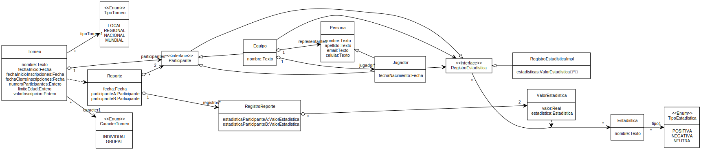
</div>

---

<style scoped>
.texto:after {
    content: 'Descomposición: ¿Cómo se distribuyen las funcionalidades?';
  }
</style>

- Almacenar la información de un torneo


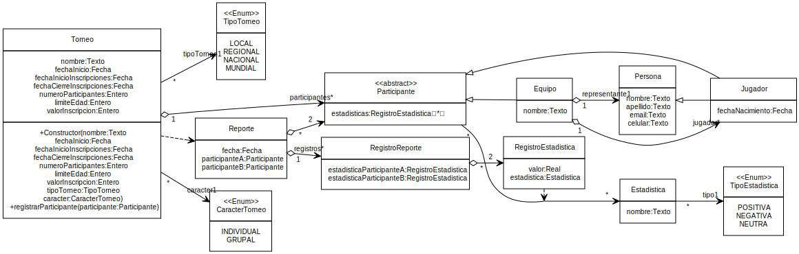

---


<style scoped>
.texto:after {
    content: 'Descomposición: ¿Cómo se distribuyen las funcionalidades?';
  }
</style>

- Recuperar la información de un torneo

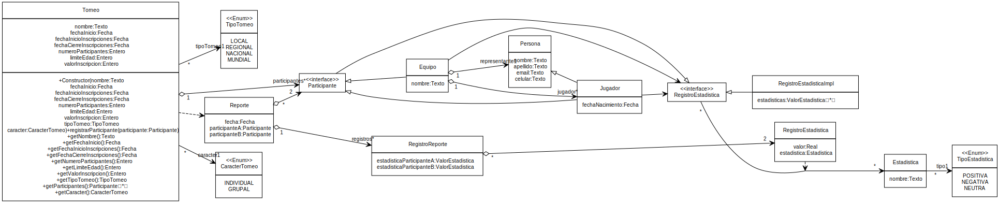

---


<style scoped>
.texto:after {
    content: 'Descomposición: ¿Cómo se distribuyen las funcionalidades?';
  }
</style>


- Modificar las fechas de inscripción e inicio 
del torneo

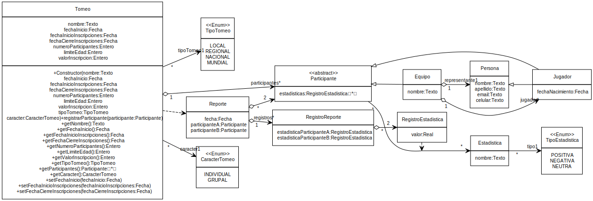

---


<style scoped>
.texto:after {
    content: 'Descomposición: ¿Cómo se distribuyen las funcionalidades?';
  }
section{
  font-size:14.5pt
}  
</style>


- Almacenar la información de los equipos y su representante
  - Validar que no se debe excederse el número máximo de equipos
  - Validar que la inscripción se realice dentro de las fechas permitidas
  - Validar que no se permita registrar un equipo con el mismo nombre de uno ya registrado


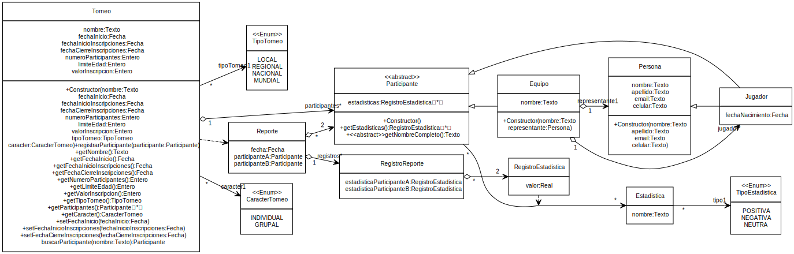


---

<style scoped>
.texto:after {
    content: 'Descomposición: ¿Cómo se distribuyen las funcionalidades?';
  }
</style>


- Recuperar la información de los equipos y su representante


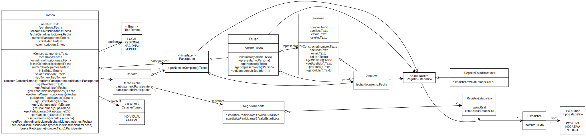

---

<style scoped>
.texto:after {
    content: 'Descomposición: ¿Cómo se distribuyen las funcionalidades?';
  }
img[alt~="center"] {
  display: block;
  margin: 0 auto;
}

</style>


- Almacenar la información de los jugadores

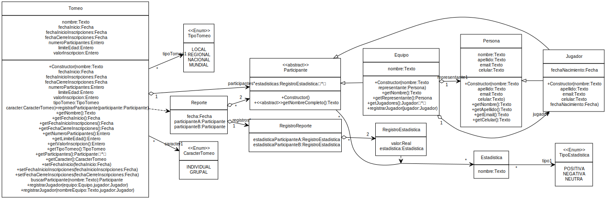

---


<style scoped>
.texto:after {
    content: 'Descomposición: ¿Cómo se distribuyen las funcionalidades?';
  }
img[alt~="center"] {
  display: block;
  margin: 0 auto;
}
</style>

- Recuperar la información de los jugadores

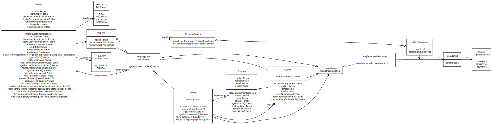

---

<style scoped>
.texto:after {
    content: 'Descomposición: ¿Cómo se distribuyen las funcionalidades?';
  }
img[alt~="center"] {
  display: block;
  margin: 0 auto;
}
</style>

- Soportar torneos individuales (Un jugador sin representante) y grupales. (Ya se han realizado los cambios necesarios)

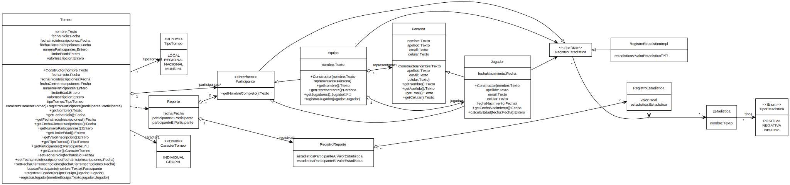

---


<style scoped>
.texto:after {
    content: 'Descomposición: ¿Cómo se distribuyen las funcionalidades?';
  }
img[alt~="center"] {
  display: block;
  margin: 0 auto;
}
</style>

- Almacenar la información de estadísticas de los participantes.

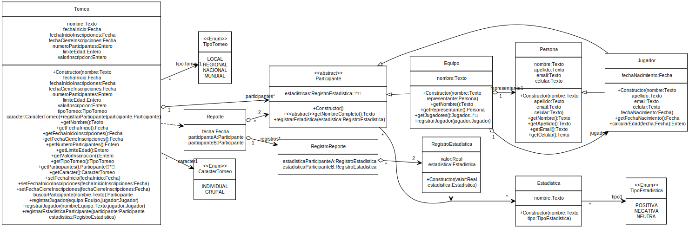

---


<style scoped>
.texto:after {
    content: 'Descomposición: ¿Cómo se distribuyen las funcionalidades?';
  }
img[alt~="center"] {
  display: block;
  margin: 0 auto;
}
</style>

- Recuperar la información de estadísticas de los participantes.

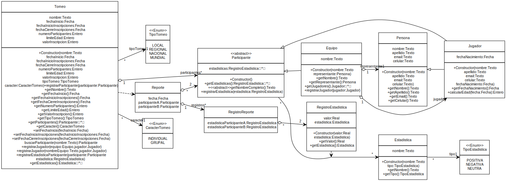

---

<style scoped>
.texto:after {
    content: 'Descomposición: ¿Cómo se distribuyen las funcionalidades?';
  }
section{
  font-size: 8pt
}

img[alt~="center"] {
  display: block;
  margin: 0 auto;
}
</style>

- Realizar consultas sobre las estadísticas de los participantes:
  - Dada una estadística obtener el participante con la mayor valor en dicha estadística.
  - Dada una estadística y un valor obtener los participantes con dicha estadística superior o igual a la dada.
  - Dada una estadística y un valor obtener los participantes con dicha estadística inferior a la dada.
  - Dada una estadística obtener la media de dicha estadística entre los participantes del torneo.
  - Dado un participante devolver las estadísticas de dicho participante

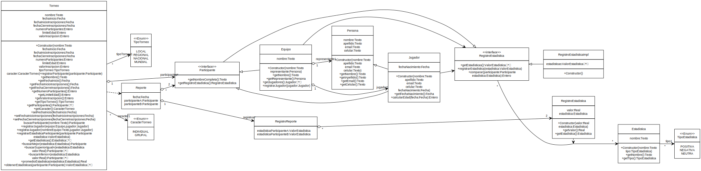

---


<style scoped>
.texto:after {
    content: 'Descomposición: ¿Cómo se distribuyen las funcionalidades?';
  }
img[alt~="center"] {
  display: block;
  margin: 0 auto;
}
</style>

- Comparar una estadística presente en dos participantes (A,B).

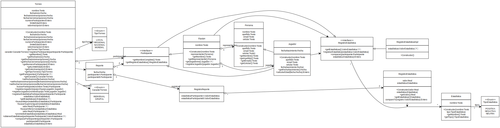

---


<style scoped>
.texto:after {
    content: 'Descomposición: ¿Cómo se distribuyen las funcionalidades?';
  }
img[alt~="center"] {
  display: block;
  margin: 0 auto;
}
</style>

- Generar un reporte con las estadísticas de dos participantes. 

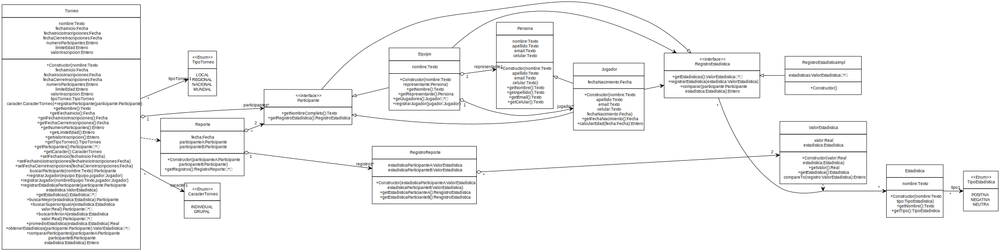

---

<style scoped>
.texto:after {
    content: 'Descomposición: ¿Qué debo hacer para probar las funcionalidades?';
  }
</style>

- Almacenar datos de prueba
- Recuperar los datos de prueba
- Verificar que los datos almacenados coinciden con los datos recuperados
- Modificar datos de la prueba
- Recuperar datos de la prueba
- Verificar que los datos almacenados y modificados coinciden con los datos recuperados


---


<style scoped>
.texto:after {
    content: 'Descomposición: ¿Qué debo hacer para probar las funcionalidades?';
  }
</style>

<div style="font-size: 9pt">
<!-- https://www.tablesgenerator.com/markdown_tables -->

| Prueba                                | Entrada de datos                                          | Salida (Resultado)                                                                                  |
|---------------------------------------|-----------------------------------------------------------|-----------------------------------------------------------------------------------------------------|
| Datos Completos                       | Copa Mundo\|2023-10-01\| 2023-08-01\|2023-09-15\|24\|0\|0\|LOCAL\|GRUPAL | Torneo creado con los datos proporcionados Copa Mundo\|2023-10-01\|2023-08-01\|2023-09-15\|24\|0\|0\|LOCAL\|GRUPAL |
| Con datos nulos                      | null\|null\|null\|null\|24\|0\|0\|null\|null                          | Error, faltan datos para la creación del torneo                                                     |
| Participantes negativos               | Copa Mundo\|2023-10-01\|2023-08-01\|2023-09-15\|-24\|0\|0\|LOCAL\|GRUPAL | Error: porque no se puede crear un torneo con número negativo de participantes                      |
| Limite edad negativo                  | Copa Mundo\|2023-10-01\|2023-08-01\|2023-09-15\|24\|-1\|0\|LOCAL\|GRUPAL | Error: porque no se puede crear un torneo con número negativo en el límite de edad                  |
| Inscripción negativa                  | Copa Mundo\|2023-10-01\|2023-08-01\|2023-09-15\|24\|0\|-1\|LOCAL\|GRUPAL | Error: porque no se puede crear un torneo con número negativo en la inscripción                     |
| Fechas Inscripción tardías            | Copa Mundo\|2023-10-01\|2023-11-01\|2023-11-15\|24\|0\|0\|LOCAL\|GRUPAL  | Error: Las inscripciones no pueden ser posteriores al inicio del torneo                             |
| Cierre inscripción anterior al inicio | Copa Mundo\|2023-10-01\|2023-08-15\|2023-08-01\|24\|0\|0\|LOCAL\|GRUPAL  | Error: El cierre de las inscripciones no puede ser anterior al inicio de las inscripciones.         |

</div>

---


<style scoped>
.texto:after {
    content: 'Descomposición: ¿Qué debo hacer para probar las funcionalidades?';
  }
</style>

<div style="font-size: 9pt">
<!-- https://www.tablesgenerator.com/markdown_tables -->

| Prueba                                | Entrada de datos                                          | Salida (Resultado)                                                                                  |
|---------------------------------------|-----------------------------------------------------------|-----------------------------------------------------------------------------------------------------|
| Modificar fecha inicio, valido | Copa Mundo\|2023-10-01\| 2023-08-01\|2023-09-15\|24\|0\|0\|LOCAL\|GRUPAL  <br/> Nueva fecha de inicio 2023-10-12 | Torneo creado con los datos proporcionados Copa Mundo\|2023-10-01\|2023-08-01\|2023-09-15\|24\|0\|0\|LOCAL\|GRUPAL   <br/> Torneo con los datos modificados Copa Mundo\|2023-10-12\|2023-08-01\|2023-09-15\|24\|0\|0\|LOCAL\|GRUPAL |
| Modificar fecha inicio, con null | Copa Mundo\|2023-10-01\| 2023-08-01\|2023-09-15\|24\|0\|0\|LOCAL\|GRUPAL  <br/>  Nueva fecha de inicio null      | Torneo creado con los datos proporcionados Copa Mundo\|2023-10-01\|2023-08-01\|2023-09-15\|24\|0\|0\|LOCAL\|GRUPAL  <br/>  Error la fecha de inicio no puede ser null                                               |
| Modificar fecha inicio, con fecha de inicio anterior a las inscripciones | Copa Mundo\|2023-10-01\| 2023-08-01\|2023-09-15\|24\|0\|0\|LOCAL\|GRUPAL  Nueva fecha de inicio 2023-07-01 | Torneo creado con los datos proporcionados Copa Mundo\|2023-10-01\|2023-08-01\|2023-09-15\|24\|0\|0\|LOCAL\|GRUPAL  Error la fecha de inicio es anterior a las inscripciones                                 |
| Modificar fecha inicio de inscripciones, valido | Copa Mundo\|2023-10-01\| 2023-08-01\|2023-09-15\|24\|0\|0\|LOCAL\|GRUPAL  <br/> Nueva fecha de inicio de inscripciones 2023-08-10 | Torneo creado con los datos proporcionados Copa Mundo\|2023-10-01\|2023-08-01\|2023-09-15\|24\|0\|0\|LOCAL\|GRUPAL   <br/> Torneo con los datos modificados Copa Mundo\|2023-10-01\|2023-08-10\|2023-09-15\|24\|0\|0\|LOCAL\|GRUPAL |
| Modificar fecha inicio de inscripciones con null | Copa Mundo\|2023-10-01\| 2023-08-01\|2023-09-15\|24\|0\|0\|LOCAL\|GRUPAL  <br/>  Nueva fecha de inicio de inscripciones null      | Torneo creado con los datos proporcionados Copa Mundo\|2023-10-01\|2023-08-01\|2023-09-15\|24\|0\|0\|LOCAL\|GRUPAL  <br/>  Error la fecha de inicio de inscripciones no puede ser null                                               |


</div>

---

<style scoped>
.texto:after {
    content: 'Descomposición: ¿Qué debo hacer para probar las funcionalidades?';
  }
</style>

<div style="font-size: 9pt">
<!-- https://www.tablesgenerator.com/markdown_tables -->

| Prueba                                | Entrada de datos                                          | Salida (Resultado)                                                                                  |
|---------------------------------------|-----------------------------------------------------------|-----------------------------------------------------------------------------------------------------|
| Modificar fecha inicio de inscripciones con fecha de inicio posterior a la fecha de cierre de inscripciones | Copa Mundo\|2023-10-01\| 2023-08-01\|2023-09-15\|24\|0\|0\|LOCAL\|GRUPAL  Nueva fecha de inicio de inscripciones 2023-09-16 | Torneo creado con los datos proporcionados Copa Mundo\|2023-10-01\|2023-08-01\|2023-09-15\|24\|0\|0\|LOCAL\|GRUPAL  Error la fecha de inicio de inscripciones no puede ser posterior a la fecha de cierre                                  |
| Modificar fecha de cierre de inscripciones, valido | Copa Mundo\|2023-10-01\| 2023-08-01\|2023-09-15\|24\|0\|0\|LOCAL\|GRUPAL  <br/> Nueva fecha de cierre de inscripciones 2023-09-16 | Torneo creado con los datos proporcionados Copa Mundo\|2023-10-01\|2023-08-01\|2023-09-15\|24\|0\|0\|LOCAL\|GRUPAL   <br/> Torneo con los datos modificados Copa Mundo\|2023-10-01\|2023-08-10\|2023-09-16\|24\|0\|0\|LOCAL\|GRUPAL |
| Modificar fecha de cierre de inscripciones con null | Copa Mundo\|2023-10-01\| 2023-08-01\|2023-09-15\|24\|0\|0\|LOCAL\|GRUPAL  <br/>  Nueva fecha de cierre de inscripciones null      | Torneo creado con los datos proporcionados Copa Mundo\|2023-10-01\|2023-08-01\|2023-09-15\|24\|0\|0\|LOCAL\|GRUPAL  <br/>  Error la fecha de cierre de inscripciones no puede ser null                                               |
| Modificar fecha de cierre de inscripciones con fecha posterior a la fecha de inicio del torneo | Copa Mundo\|2023-10-01\| 2023-08-01\|2023-09-15\|24\|0\|0\|LOCAL\|GRUPAL  Nueva fecha de cierre de inscripciones 2023-10-02 | Torneo creado con los datos proporcionados Copa Mundo\|2023-10-01\|2023-08-01\|2023-09-15\|24\|0\|0\|LOCAL\|GRUPAL  Error la fecha de cierre de inscripciones no puede ser posterior a la fecha de inicio del torneo                                  |
| Modificar fecha de cierre de inscripciones con fecha anterior a la fecha de inicio de inscripciones | Copa Mundo\|2023-10-01\| 2023-08-01\|2023-09-15\|24\|0\|0\|LOCAL\|GRUPAL  Nueva fecha de cierre de inscripciones 2023-07-30 | Torneo creado con los datos proporcionados Copa Mundo\|2023-10-01\|2023-08-01\|2023-09-15\|24\|0\|0\|LOCAL\|GRUPAL  Error la fecha de cierre de inscripciones no puede ser anterior a la fecha de inicio de inscripciones                                  |

</div>

---


<style scoped>
.texto:after {
    content: 'Descomposición: ¿Qué debo hacer para probar las funcionalidades?';
  }
</style>

<div style="font-size: 9pt">
<!-- https://www.tablesgenerator.com/markdown_tables -->

| Prueba                                | Entrada de datos                                          | Salida (Resultado)                                                                                  |
|---------------------------------------|-----------------------------------------------------------|-----------------------------------------------------------------------------------------------------|
| Registrar un equipo en el torneo                       | Torneo{Copa Mundo\|fechaActual+ 1mes\| fechaActual - 15 días\|fechaActual+15 días\|24\|0\|0\|LOCAL\|GRUPAL}  Equipo{Uniquindio} Representante{Robinson,Pulgarin,rpulgarin@email.com,6067359300} | Torneo creado con los datos proporcionados Copa Mundo\|fechaActual+ 1mes\| fechaActual - 15 días\|fechaActual+15 días\|24\|0\|0\|LOCAL\|GRUPAL\|[Equipo{uniquindio,{Robinson,Pulgarin,rpulgarin@email.com,6067359300}}] |
| Registrar un equipo con nombre repetido                     | Torneo{Copa Mundo\|fechaActual+ 1mes\| fechaActual - 15 días\|fechaActual+15 días\|24\|0\|0\|LOCAL\|GRUPAL}  Equipo{Uniquindio} Representante{Robinson,Pulgarin,rpulgarin@email.com,6067359300}, Equipo{Uniquindio} Representante{Robinson,Pulgarin,rpulgarin@email.com,6067359300}                          | Error, el equipo ya existe                                                     |
| Registro cuando las inscripciones ya cerraron               | Torneo{Copa Mundo\|fechaActual+ 1mes\| fechaActual - 15 días\|fechaActual-1 día\|24\|0\|0\|LOCAL\|GRUPAL}  Equipo{Uniquindio} Representante{Robinson,Pulgarin,rpulgarin@email.com,6067359300}                           | Error: Las inscripciones ya cerraron                      |
| Registro cuando las inscripciones no han abierto  | Torneo{Copa Mundo\|fechaActual+ 1mes\| fechaActual + 1 día\|fechaActual+15 días\|24\|0\|0\|LOCAL\|GRUPAL}  Equipo{Uniquindio} Representante{Robinson,Pulgarin,rpulgarin@email.com,6067359300}                           | Error: Las inscripciones no han abierto                      |

---

<style scoped>
.texto:after {
    content: 'Descomposición: ¿Qué debo hacer para probar las funcionalidades?';
  }  
</style>

<div style="font-size: 9pt">
<!-- https://www.tablesgenerator.com/markdown_tables -->

| Prueba                                | Entrada de datos                                          | Salida (Resultado)                                                                                  |
|---------------------------------------|-----------------------------------------------------------|-----------------------------------------------------------------------------------------------------|
| Registrar un jugador en un equipo desde el equipo      | Equipo{Uniquindio} Representante{Robinson,Pulgarin,rpulgarin@email.com,6067359300} Jugador {Christian,Candela,chrcandela@email.com,6067431234, fechaActual - 15 años} | Torneo creado con los datos proporcionados Copa Mundo\|fechaActual+ 1mes\| fechaActual - 15 días\|fechaActual+15 días\|24\|18\|0\|LOCAL\|GRUPAL\|[Equipo{uniquindio,{Robinson,Pulgarin,rpulgarin@email.com,6067359300}} Jugador {Christian,Candela,chrcandela@email.com,6067431234}] |
| Registrar un jugador en un equipo desde el torneo      | Torneo{Copa Mundo\|fechaActual+ 1mes\| fechaActual - 15 días\|fechaActual+15 días\|24\|18\|0\|LOCAL\|GRUPAL}  Equipo{Uniquindio} Representante{Robinson,Pulgarin,rpulgarin@email.com,6067359300} Jugador {Christian,Candela,chrcandela@email.com,6067431234, fechaActual - 15 años} | Torneo creado con los datos proporcionados Copa Mundo\|fechaActual+ 1mes\| fechaActual - 15 días\|fechaActual+15 días\|24\|18\|0\|LOCAL\|GRUPAL\|[Equipo{uniquindio,{Robinson,Pulgarin,rpulgarin@email.com,6067359300}} Jugador {Christian,Candela,chrcandela@email.com,6067431234}] |
| Registrar un jugador en un torneo sin limite de edad (0)      | Torneo{Copa Mundo\|fechaActual+ 1mes\| fechaActual - 15 días\|fechaActual+15 días\|24\|0\|0\|LOCAL\|GRUPAL}  Equipo{Uniquindio} Representante{Robinson,Pulgarin,rpulgarin@email.com,6067359300} Jugador {Christian,Candela,chrcandela@email.com,6067431234, fechaActual - 21 años} | Torneo{Copa Mundo\|fechaActual+ 1mes\| fechaActual - 15 días\|fechaActual+15 días\|24\|0\|0\|LOCAL\|GRUPAL}  Equipo{Uniquindio} Representante{Robinson,Pulgarin,rpulgarin@email.com,6067359300} Jugador {Christian,Candela,chrcandela@email.com,6067431234, fechaActual - 21 años} |
| Registrar un jugador mayor a la edad permitida (desde el torneo)      | Torneo{Copa Mundo\|fechaActual+ 1mes\| fechaActual - 15 días\|fechaActual+15 días\|24\|18\|0\|LOCAL\|GRUPAL}  Equipo{Uniquindio} Representante{Robinson,Pulgarin,rpulgarin@email.com,6067359300} Jugador {Christian,Candela,chrcandela@email.com,6067431234, fechaActual - 21 años} | Error, el jugador es mayor a la edad límite. |

</div>

---


<style scoped>
.texto:after {
    content: 'Descomposición: ¿Qué debo hacer para probar las funcionalidades?';
  }
</style>

<div style="font-size: 9pt">
<!-- https://www.tablesgenerator.com/markdown_tables -->

| Prueba                                | Entrada de datos                                          | Salida (Resultado)                                                                                  |
|---------------------------------------|-----------------------------------------------------------|-----------------------------------------------------------------------------------------------------|
| Registro de un jugador si las inscripciones ya cerraron               | Torneo{Copa Mundo\|fechaActual+ 1mes\| fechaActual - 15 días\|fechaActual-1 día\|24\|18\|0\|LOCAL\|GRUPAL}  Equipo{Uniquindio} Representante{Robinson,Pulgarin,rpulgarin@email.com,6067359300} Jugador {Christian,Candela,chrcandela@email.com,6067431234, fechaActual - 15 años}                          | Error: Las inscripciones ya cerraron                      |
| Registrar dos jugadores con nombre y apellido idénticos en el mismo equipo (desde el equipo) | Equipo{Uniquindio} Representante{Robinson,Pulgarin,rpulgarin@email.com,6067359300}, Jugador {Christian,Candela,chrcandela@email.com,6067431234, fechaActual - 15 años}Jugador {Christian,Candela,ccandela@email.com,6067431235, fechaActual - 15 años}                         | Error, el jugador ya existe                                                     |
| Registrar dos jugadores con nombre y apellido idénticos en equipos diferentes  (desde el torneo) | Torneo{Copa Mundo\|fechaActual+ 1mes\| fechaActual - 15 días\|fechaActual+15 días\|24\|18\|0\|LOCAL\|GRUPAL}  Equipo{Uniquindio} Representante{Robinson,Pulgarin,rpulgarin@email.com,6067359300},  Jugador {Christian,Candela,chrcandela@email.com,6067431234, fechaActual - 15 años}, Jugador {Christian,Candela,ccandela@email.com,6067431235, fechaActual - 15 años}, Equipo{Quindío}    | Error, el jugador ya existe                                                     |
</div>

---


<style scoped>
.texto:after {
    content: 'Descomposición: ¿Qué debo hacer para probar las funcionalidades?';
  }
</style>

<div style="font-size: 9pt">
<!-- https://www.tablesgenerator.com/markdown_tables -->

| Prueba                                | Entrada de datos                                          | Salida (Resultado)                                                                                  |
|---------------------------------------|-----------------------------------------------------------|-----------------------------------------------------------------------------------------------------|
| Registrar un participante en el torneo                       | Torneo{Copa Mundo\|fechaActual+ 1mes\| fechaActual - 15 días\|fechaActual+15 días\|24\|0\|0\|LOCAL\|INDIVIDUAL}  Jugador {Christian,Candela,chrcandela@email.com,6067431234, fechaActual - 15 años} | Torneo creado con los datos proporcionados Copa Mundo\|fechaActual+ 1mes\| fechaActual - 15 días\|fechaActual+15 días\|24\|0\|0\|LOCAL\|INDIVIDUAL\|[Jugador {Christian,Candela,chrcandela@email.com,6067431234, fechaActual - 15 años}] |
| Registrar un participante individual con nombre repetido                     | Torneo{Copa Mundo\|fechaActual+ 1mes\| fechaActual - 15 días\|fechaActual+15 días\|24\|0\|0\|LOCAL\|INDIVIDUAL}  Jugador {Christian,Candela,chrcandela@email.com,6067431234, fechaActual - 15 años}, Jugador {Christian,Candela,ccandela@email.com,6067431235, fechaActual - 15 años}                          | Error, el participante ya existe                                                     |
| Registrar un participante individual en un torneo grupal                     | Torneo{Copa Mundo\|fechaActual+ 1mes\| fechaActual - 15 días\|fechaActual+15 días\|24\|0\|0\|LOCAL\|GRUPAL}  Jugador {Christian,Candela,chrcandela@email.com,6067431234, fechaActual - 15 años}                          | Error, no es posible registrar un participante individual en un torneo grupal                                                     |
| Registrar un equipo en un torneo individual                     | Torneo{Copa Mundo\|fechaActual+ 1mes\| fechaActual - 15 días\|fechaActual+15 días\|24\|0\|0\|LOCAL\|INDIVIDUAL}  Equipo{Uniquindio} Representante{Robinson,Pulgarin,rpulgarin@email.com,6067359300}                          | Error, no es posible registrar un equipo en un torneo individual                                                     |

---

<style scoped>
.texto:after {
    content: 'Descomposición: ¿Qué debo hacer para probar las funcionalidades?';
  }
</style>

- Para el siguiente conjunto de pruebas se va a asumir la creación del siguiente conjunto de datos por defecto.

```json
{
  torneos: [
    {nombre:"Copa Mundo Ajedrez",
    "fechaInicio":"fechaActual + 1mes", "fechaInicioInscripciones": "fechaActual - 15 días", "fechaCierreInscripciones": "fechaActual+15 días", 
    "numeroParticipante": 24, "limiteEdad":0,"valorInscripcion":0, "tipoTorneo":"LOCAL","caracter":"INDIVIDUAL", 
    "participantes": [
      {"nombre":"ParticipanteA","apellido":"JugadorA","email":"jugadora@email.com","telefono":"6067431234", "fechaNacimiento":"fechaActual - 15 años", "estadisticas":[ 
        {"valor":3.3 , "Estadistica":{"nombre":"Efectividad","tipo":"POSITIVA"}},
        {"valor":4.5 , "Estadistica":{"nombre":"Errores","tipo":"NEGATIVA"}}]},
      {"nombre":"ParticipanteB","apellido":"JugadorB","email":"jugadorb@email.com","telefono":"6067431235", "fechaNacimiento":"fechaActual - 16 años", "estadisticas":[ 
        {"valor":4.3 , "Estadistica":{"nombre":"Efectividad","tipo":"POSITIVA"}},
        {"valor":3.5 , "Estadistica":{"nombre":"Errores","tipo":"NEGATIVA"}}]},
      {"nombre":"ParticipanteC","apellido":"JugadorC","email":"jugadorc@email.com","telefono":"6067431236", "fechaNacimiento":"fechaActual - 17 años", "estadisticas":[ 
        {"valor":2.3 , "Estadistica":{"nombre":"Efectividad","tipo":"POSITIVA"}},
        {"valor":2.5 , "Estadistica":{"nombre":"Errores","tipo":"NEGATIVA"}}]}]},
    {nombre:"Copa Mundo Futbol",
    "fechaInicio":"fechaActual + 1mes", "fechaInicioInscripciones": "fechaActual - 15 días", "fechaCierreInscripciones": "fechaActual+15 días", 
    "numeroParticipante": 24, "limiteEdad":0,"valorInscripcion":0, "tipoTorneo":"MUNDIAL","caracter":"GRUPAL", 
    "participantes": [
      {"nombre":"Uniquindio","representante":{"nombre":"robinson","apellido":"pulgarin","email":"rpulgarin@email.com","telefono":"6067359300"},"estadisticas":[ 
        {"valor":3.3 , "Estadistica":{"nombre":"Efectividad","tipo":"POSITIVA"}},
        {"valor":4.5 , "Estadistica":{"nombre":"Errores","tipo":"NEGATIVA"}}]},
      {"nombre":"Armenia","representante":{"nombre":"alcalde","apellido":"politico","email":"politico@email.com","telefono":"6067369300"}, "estadisticas":[ 
        {"valor":4.3 , "Estadistica":{"nombre":"Efectividad","tipo":"POSITIVA"}},
        {"valor":3.5 , "Estadistica":{"nombre":"Errores","tipo":"NEGATIVA"}}]},
      {"nombre":"Cafeteros","representante":{"nombre":"representante","apellido":"cafetero","email":"rcafetero@email.com","telefono":"6067379300"}, "estadisticas":[ 
        {"valor":2.3 , "Estadistica":{"nombre":"Efectividad","tipo":"POSITIVA"}},
        {"valor":2.5 , "Estadistica":{"nombre":"Errores","tipo":"NEGATIVA"}}]},
      {"nombre":"Novatos","representante":{"nombre":"novato","apellido":"cafetero","email":"novato@email.com","telefono":"6067389300"}, "estadisticas":[ ]}]}
  ]
}
```

---

<style scoped>
.texto:after {
    content: 'Descomposición: ¿Qué debo hacer para probar las funcionalidades?';
  }
</style>

<div style="font-size: 9pt">
<!-- https://www.tablesgenerator.com/markdown_tables -->

| Prueba                                | Entrada de datos                                          | Salida (Resultado)                                                                                  |
|---------------------------------------|-----------------------------------------------------------|-----------------------------------------------------------------------------------------------------|
| Registrar estadística a un participante                       | datos por defecto | Como resultado se espera los dos torneos creados, cada uno con 3 participantes, cada uno de ellos con dos estadísticas. (Ver datos por defecto) |
| Registrar estadística a un participante que no esta registrado en el torneo                       | Torneo "Copa Mundo Ajedrez",  Jugador {ParticipanteX,JugadorX,jugadorx@email.com,6067431239, fechaActual - 15 años} ValorEstadistica{3.3 , Estadistica{Efectividad,POSITIVA} } | Error, el participante no está registrado en el torneo |
| Registrar estadística con datos nulos (participante o estadística nulos)                       | Torneo "Copa Mundo Ajedrez",  Jugador "ParticipanteA" ValorEstadistica null | Error, la estadística es requerida |
| Registrar estadística con datos nulos (participante o estadística nulos)                       | Torneo{Copa Mundo\|fechaActual+ 1mes\| fechaActual - 15 días\|fechaActual+15 días\|24\|0\|0\|LOCAL\|INDIVIDUAL}  Jugador null ValorEstadistica{3.3 , Estadistica{Efectividad,POSITIVA} | Error, el jugador es requerido |
| Registrar una estadística a un participante que ya la posee (actualizar estadística) | Torneo "Copa Mundo Ajedrez",  Jugador "ParticipanteA" ValorEstadistica{4.3 , Estadistica{Efectividad,POSITIVA} } | Jugador "ParticipanteA" con estadisticas [ ValorEstadistica{4.3 , Estadistica{Efectividad,POSITIVA}}, ValorEstadistica{4.5 , Estadistica{Errores,NEGATIVA}}] |


---

<style scoped>
.texto:after {
    content: 'Descomposición: ¿Qué debo hacer para probar las funcionalidades?';
  }
</style>

<div style="font-size: 9pt">
<!-- https://www.tablesgenerator.com/markdown_tables -->

| Prueba                                | Entrada de datos                                          | Salida (Resultado)                                                                                  |
|---------------------------------------|-----------------------------------------------------------|-----------------------------------------------------------------------------------------------------|
| Obtener las estadísticas de un participante | Torneo "Copa Mundo Ajedrez",  Jugador "ParticipanteA" Al solicitar las estadísticas del participante  | [ ValorEstadistica{3.3 , Estadistica{Efectividad,POSITIVA}},ValorEstadistica{4.5 , Estadistica{Errores,NEGATIVA} }]|
| Obtener las estadísticas de un participante sin estadisticas | Torneo "Copa Mundo",  Equipo "Novatos" Al solicitar las estadísticas del participante  | [ ]|
| Obtener las estadisticas de un participante no existente                      | Torneo "Copa Mundo Ajedrez",  Jugador {ParticipanteX,JugadorX,jugadorx@email.com,6067431239, fechaActual - 15 años}, Al solicitar las estadísticas | Error, el participante no está registrado en el torneo |
| Obtener las estadisticas de un participante no existente                      | Torneo "Copa Mundo Ajedrez",  Jugador null, Al solicitar las estadísticas | Error, el participante es requerido |
| Obtener el participante con la mayor estadística (POSITIVA)                     | Torneo "Copa Mundo Ajedrez" Estadistica "Efectividad" | Jugador "ParticipanteB" |

---

<style scoped>
.texto:after {
    content: 'Descomposición: ¿Qué debo hacer para probar las funcionalidades?';
  }
</style>

<div style="font-size: 9pt">
<!-- https://www.tablesgenerator.com/markdown_tables -->

| Prueba                                | Entrada de datos                                          | Salida (Resultado)                                                                                  |
|---------------------------------------|-----------------------------------------------------------|-----------------------------------------------------------------------------------------------------|
| Obtener el participante con la mayor estadística (NEGATIVA)                     | Torneo "Copa Mundo Ajedrez" Estadistica "Errores" | Jugador "ParticipanteC" |
| Obtener el participante con la mayor estadística de una estadística inexistente                     | Torneo "Copa Mundo Ajedrez" Estadistica {"Mejor",POSITIVA} | [] |
| Pedir del participante de mayor estadística de en un torneo sin participantes | Torneo{Copa Mundo\|fechaActual+ 1mes\| fechaActual - 15 días\|fechaActual+15 días\|24\|0\|0\|LOCAL\|INDIVIDUAL} Estadistica {"Mejor",POSITIVA} | [] | 
| Obtener los participantes con estadística superior o igual a la dada (POSITIVA)                     | Torneo "Copa Mundo Ajedrez" Estadistica "Efectividad" , 3.3 | [Jugador "ParticipanteA",Jugador "ParticipanteB"] |
| Obtener los participantes con estadística superior o igual a la dada (NEGATIVA)                     | Torneo "Copa Mundo Ajedrez" Estadistica "Errores" , 3.5 | [Jugador "ParticipanteB",Jugador "ParticipanteC"] |
| Obtener los participantes con estadística superior o igual a la dada de estadística inexistente | Torneo "Copa Mundo Ajedrez" Estadistica {"Mejor",POSITIVA} , 3 | [] |
| Obtener los participantes con estadística inferior a la dada (POSITIVA)                     | Torneo "Copa Mundo Ajedrez" Estadistica "Efectividad" , 3.3 | [Jugador "ParticipanteC"] |
| Obtener los participantes con estadística inferior a la dada (NEGATIVA)                     | Torneo "Copa Mundo Ajedrez" Estadistica "Errores" , 3.5 | [Jugador "ParticipanteA"] |

--- 

<style scoped>
.texto:after {
    content: 'Descomposición: ¿Qué debo hacer para probar las funcionalidades?';
  }
</style>

<div style="font-size: 9pt">
<!-- https://www.tablesgenerator.com/markdown_tables -->

| Prueba                                | Entrada de datos                                          | Salida (Resultado)                                                                                  |
|---------------------------------------|-----------------------------------------------------------|-----------------------------------------------------------------------------------------------------|
| Obtener los participantes con estadística inferior a la dada de estadística inexistente | Torneo "Copa Mundo Ajedrez" Estadistica "Mejor" , 3 | [] |
| Obtener la medía de una estadística dada                      | Torneo "Copa Mundo Ajedrez" Estadistica "Efectividad"  | 3.3 |
| Obtener la medía de una estadística inexistente                     | Torneo "Copa Mundo Ajedrez" Estadistica {"Mejor",POSITIVA} | Error, no se cuentan con datos para calcular la media |
| Comparar una estadística (POSITIVA) presente en dos participantes A<B                      | Torneo "Copa Mundo Ajedrez" Jugador "ParticipanteA" Jugador "ParticipanteB" Estadistica "Efectividad"  | Resultado Negativo ( < 0) |
| Comparar una estadística (POSITIVA) presente en dos participantes B>A                      | Torneo "Copa Mundo Ajedrez" Jugador "ParticipanteB" Jugador "ParticipanteA" Estadistica "Efectividad"  | Resultado Positivo ( > 0) |
| Comparar una estadística (NEGATIVA) presente en dos participantes A<B                      | Torneo "Copa Mundo Ajedrez" Jugador "ParticipanteA" Jugador "ParticipanteB" Estadistica "Errores"  | Resultado Negativo ( < 0) |
| Comparar una estadística (NEGATIVA) presente en dos participantes B>A                      | Torneo "Copa Mundo Ajedrez" Jugador "ParticipanteB" Jugador "ParticipanteA" Estadistica "Errores"  | Resultado Positivo ( > 0) |

---

<!-- 
_header: ''
_footer: '' 
_paginate: false
_backgroundImage: url('imagenes/gracias.png')
-->
